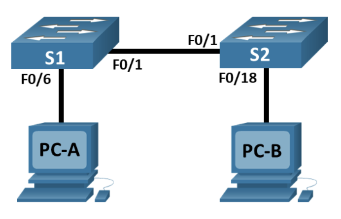
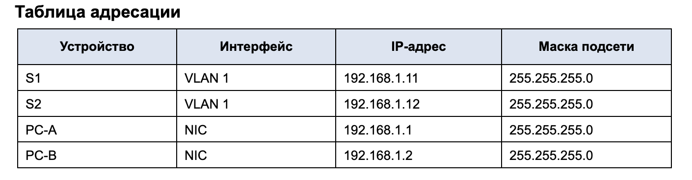
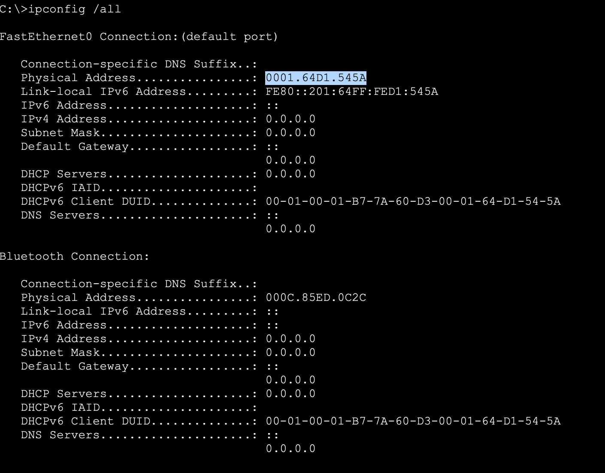
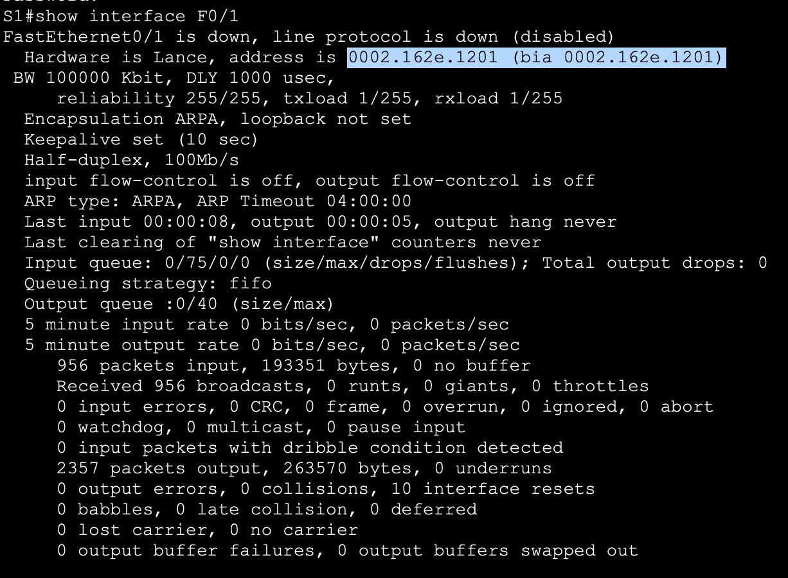
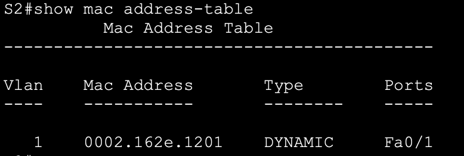
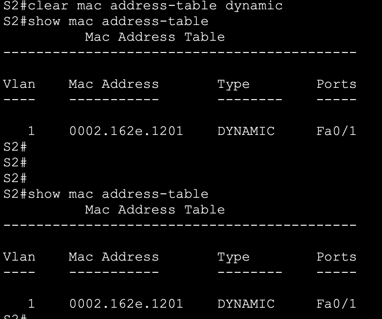
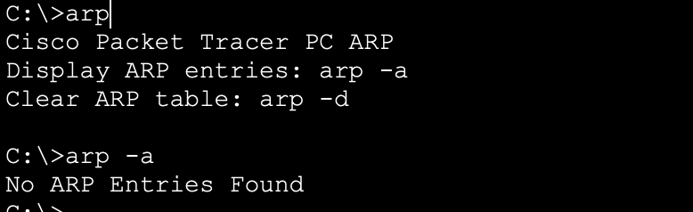
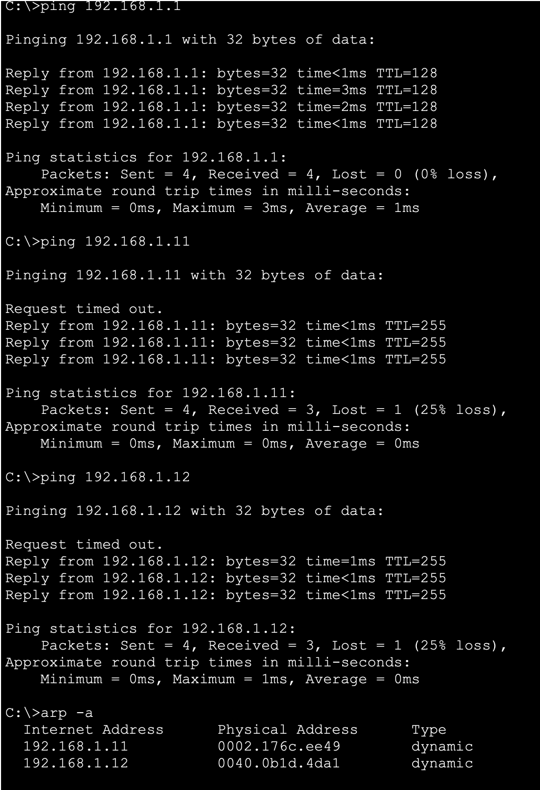
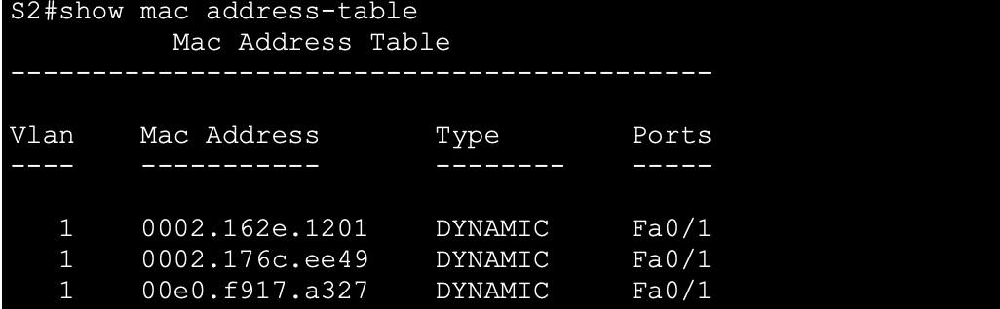
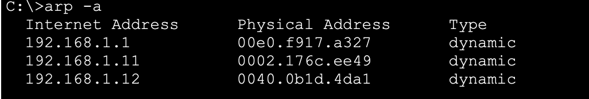

# Лабораторная работа. Просмотр таблицы MAC-адресов коммутатора

## Топология

## Таблица адресации

## Часть 2. Изучение таблицы МАС-адресов коммутатора

###### 2.1 МАС-адреса сетевых устройств
> Физический адрес адаптера Ethernet компьютера PC-A

(`00E0.F917.A327`)

> Физический адрес адаптера Ethernet компьютера PC-B

(`0001.64D1.545A`)

> МАС-адрес коммутатора S1 Fast Ethernet 0/1:

(`0002.162e.1201 (bia 0002.162e.1201)`)

> МАС-адрес коммутатора S2 Fast Ethernet 0/1:

(`0060.7027.1101 (bia 0060.7027.1101)`)

###### 2.2 Таблица МАС-адресов коммутатора

> Записаны ли в таблице МАС-адресов какие-либо МАС-адреса?

Да, записан 1 адрес

> Какие МАС-адреса записаны в таблице? С какими портами коммутатора они сопоставлены и каким устройствам принадлежат? 

Записан 1 мак адрес устройства подключеного к  порту F0/1. Адресс принадлежит Switch S1

> Если вы не записали МАС-адреса сетевых устройств в шаге 1, как можно определить, каким устройствам принадлежат МАС-адреса, используя только выходные данные команды show mac address-table? 

Можно определить мак адреес подключеного устройства, если знать топологию сети. 

> Работает ли это решение в любой ситуации?

Нет. В случае отсутсвия коммутации между другими подключеными устройствами к коммутатору отсутсвуют сведения о данных устройствах.

###### 2.3 Очистите таблицу МАС-адресов коммутатора S2 и снова отобразите таблицу МАС-адресов

> Указаны ли в таблице МАС-адресов адреса для VLAN 1? 

Да, указаны.

> Указаны ли другие МАС-адреса?

Нет. только для Vlan 1

> Через 10 секунд введите команду show mac address-table и нажмите клавишу ввода. Появились ли в таблице МАС-адресов новые адреса?

нет. новых адрессов нет

###### 2.4 Эхо-запросы 

> Не считая адресов многоадресной и широковещательной рассылки, сколько пар IP- и МАС-адресов устройств было получено через протокол ARP?

Получено 0 адрессов

> b.	Из командной строки PC-B отправьте эхо-запросы на компьютер PC-A, а также коммутаторы S1 и S2.Вопрос:От всех ли устройств получены ответы? 

Да ответы получены от всех устройств

> Добавил ли коммутатор в таблицу МАС-адресов дополнительные МАС-адреса? 

Да. добавил

> Если да, то какие адреса и устройства?

PC-B, S1

> Появились ли в ARP-кэше компьютера PC-B дополнительные записи для всех сетевых устройств, которым были отправлены эхо-запросы?

Да в таблице появились все устройства которым был отправлен запрос.

#### 	Вопрос для повторения
> В сетях Ethernet данные передаются на устройства по соответствующим МАС-адресам. Для этого коммутаторы и компьютеры динамически создают ARP-кэш и таблицы МАС-адресов. Если компьютеров в сети немного, эта процедура выглядит достаточно простой. Какие сложности могут возникнуть в крупных сетях?

Переполнение таблицы MAC адресов

