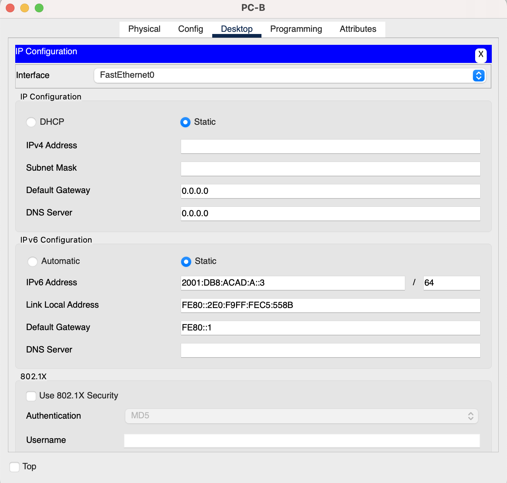

# Лабораторная работа. Настройка IPv6-адресов на сетевых устройствах 

## Топология

## Таблица адресации

### Часть 1. Настройка топологии и конфигурация основных параметров маршрутизатора и коммутатора

#### Шаг 1. Настройте маршрутизатор.

 Вывод команды show running-config 

<pre>

Building configuration...

Current configuration : 996 bytes
!
version 15.4
no service timestamps log datetime msec
no service timestamps debug datetime msec
service password-encryption
!
hostname R1
!
!
!
enable secret 5 $1$mERr$4zQ9aTNBtWMqOO3m6dXXX/
!
!
!
!
!
!
ip cef
ipv6 unicast-routing
!
no ipv6 cef
!
!
!
!
!
!
!
!
!
!
no ip domain-lookup
!
!
spanning-tree mode pvst
!
!
!
!
!
!
interface GigabitEthernet0/0/0
 no ip address
 duplex auto
 speed auto
 ipv6 address FE80::1 link-local
 ipv6 address 2001:DB8:ACAD:A::1/64
!
interface GigabitEthernet0/0/1
 no ip address
 duplex auto
 speed auto
 ipv6 address FE80::1 link-local
 ipv6 address 2001:DB8:ACAD:1::1/64
!
interface GigabitEthernet0/0/2
 no ip address
 duplex auto
 speed auto
 shutdown
!
interface Vlan1
 no ip address
 shutdown
!
ip classless
!
ip flow-export version 9
!
!
!
banner motd ^C^C
!
!
!
!
!
line con 0
 password 7 0822455D0A16
 logging synchronous
 login
!
line aux 0
!
line vty 0 4
 password 7 0822455D0A164844
 login
line vty 5 15
 password 7 0822455D0A164844
 login
!
!
!
end

</pre>

#### Шаг 2. Настройте коммутатор.

 Вывод команды show running-config 

<pre>

Building configuration...

Current configuration : 1356 bytes
!
version 15.0
no service timestamps log datetime msec
no service timestamps debug datetime msec
service password-encryption
!
hostname S1
!
ipv6 unicast-routing
!
!
enable secret 5 $1$mERr$8DpnT.jIAECHaur7pSf3l/
!
!
!
no ip domain-lookup
!
!
!
spanning-tree mode pvst
spanning-tree extend system-id
!
interface FastEthernet0/1
!
interface FastEthernet0/2
!
interface FastEthernet0/3
!
interface FastEthernet0/4
!
interface FastEthernet0/5
!
interface FastEthernet0/6
!
interface FastEthernet0/7
!
interface FastEthernet0/8
!
interface FastEthernet0/9
!
interface FastEthernet0/10
!
interface FastEthernet0/11
!
interface FastEthernet0/12
!
interface FastEthernet0/13
!
interface FastEthernet0/14
!
interface FastEthernet0/15
!
interface FastEthernet0/16
!
interface FastEthernet0/17
!
interface FastEthernet0/18
!
interface FastEthernet0/19
!
interface FastEthernet0/20
!
interface FastEthernet0/21
!
interface FastEthernet0/22
!
interface FastEthernet0/23
!
interface FastEthernet0/24
!
interface GigabitEthernet0/1
!
interface GigabitEthernet0/2
!
interface Vlan1
 no ip address
 ipv6 address FE80::1 link-local
 ipv6 address 2001:DB8:ACAD:1::B/64
!
banner motd ^C^C
!
!
!
!
!
line con 0
 password 7 0822404F1A0A
 logging synchronous
 login
!
line vty 0 4
 password 7 0822404F1A0A4844
 login
line vty 5 15
 password 7 0822404F1A0A4844
 login
!
!
!
!
end

</pre>

### Часть 2. Ручная настройка IPv6-адресов

#### Шаг 1. Назначьте IPv6-адреса интерфейсам Ethernet на R1.

a. Назначьте глобальные индивидуальные IPv6-адреса, указанные в таблице адресации обоим интерфейсам Ethernet на R1.

b. Введите команду show ipv6 interface brief, чтобы проверить, назначен ли каждому интерфейсу корректный индивидуальный IPv6-адрес.
Примечание. Отображаемый локальный адрес канала основан на адресации EUI-64, которая автоматически использует MAC-адрес интерфейса для создания 128-битного локального IPv6-адреса канала.

c. Чтобы обеспечить соответствие локальных адресов канала индивидуальному адресу, вручную введите локальные адреса канала на каждом интерфейсе Ethernet на R1.
Примечание. Каждый интерфейс маршрутизатора относится к отдельной сети. Пакеты с локальным адресом канала никогда не выходят за пределы локальной сети, а значит, для обоих интерфейсов можно указывать один и тот же локальный адрес канала. 

d. Используйте выбранную команду, чтобы убедиться, что локальный адрес связи изменен на fe80::1. 

> Какие группы многоадресной рассылки назначены интерфейсу G0/0?
>> Joined group address(es): FF02::1 FF02::2 FF02::1:FF00:1

 Вывод команды show ipv6 interface brief 

<pre>

GigabitEthernet0/0/0       [up/up]
    FE80::1
    2001:DB8:ACAD:A::1
GigabitEthernet0/0/1       [up/up]
    FE80::1
    2001:DB8:ACAD:1::1
GigabitEthernet0/0/2       [administratively down/down]
    unassigned
Vlan1                      [administratively down/down]
    unassigned

</pre>

#### Шаг 2. Активируйте IPv6-маршрутизацию на R1.

a. В командной строке на PC-B введите команду ipconfig, чтобы получить данные IPv6-адреса, назначенного интерфейсу ПК.

> Назначен ли индивидуальный IPv6-адрес сетевой интерфейсной карте (NIC) на PC-B?
>> Да назначен адрес, т.к. включена автоматическая кофигурация. (при вкл статической конфигурации, адреса не будут назначены)

b. Активируйте IPv6-маршрутизацию на R1 с помощью команды IPv6 unicast-routing.
Примечание. Это позволит компьютерам получать IP-адреса и данные шлюза по умолчанию с помощью функции SLAAC (Stateless Address Autoconfiguration (Автоконфигурация без сохранения состояния адреса)).

c. Теперь, когда R1 входит в группу многоадресной рассылки всех маршрутизаторов, еще раз введите команду ipconfig на PC-B. Проверьте данные IPv6-адреса.

> Почему PC-B получил глобальный префикс маршрутизации и идентификатор подсети, которые вы настроили на R1?
>> РС получает свой IPv6-адреса и префикс от маршрутизатора т.к. в нем включена IPv6 адресация

#### Шаг 3. Назначьте IPv6-адреса интерфейсу управления (SVI) на S1.

a. Назначьте адрес IPv6 для S1. Также назначьте этому интерфейсу локальный адрес канала.

b. Проверьте правильность назначения IPv6-адресов интерфейсу управления с помощью команды show ipv6 interface vlan1.

 Вывод команды show interfaces vlan 1 

<pre>

Vlan1 is up, line protocol is up
  Hardware is CPU Interface, address is 0001.42b3.82ca (bia 0001.42b3.82ca)
  MTU 1500 bytes, BW 100000 Kbit, DLY 1000000 usec,
     reliability 255/255, txload 1/255, rxload 1/255
  Encapsulation ARPA, loopback not set
  ARP type: ARPA, ARP Timeout 04:00:00
  Last input 21:40:21, output never, output hang never
  Last clearing of "show interface" counters never
  Input queue: 0/75/0/0 (size/max/drops/flushes); Total output drops: 0
  Queueing strategy: fifo
  Output queue: 0/40 (size/max)
  5 minute input rate 0 bits/sec, 0 packets/sec
  5 minute output rate 0 bits/sec, 0 packets/sec
     1682 packets input, 530955 bytes, 0 no buffer
     Received 0 broadcasts (0 IP multicast)
     0 runts, 0 giants, 0 throttles
     0 input errors, 0 CRC, 0 frame, 0 overrun, 0 ignored
     563859 packets output, 0 bytes, 0 underruns
     0 output errors, 23 interface resets
     0 output buffer failures, 0 output buffers swapped out

</pre>

#### Шаг 4. Назначьте компьютерам статические IPv6-адреса.

a. Откройте окно Свойства Ethernet для каждого ПК и назначьте адресацию IPv6.

b. Убедитесь, что оба компьютера имеют правильную информацию адреса IPv6. Каждый компьютер должен иметь два глобальных адреса IPv6: один статический и один SLACC

### Часть 3. Проверка сквозного подключения

##### С PC-A отправьте эхо-запрос на FE80::1. Это локальный адрес канала, назначенный G0/1 на R1.

 Вывод команды ping fe80::1 

<pre>

Pinging fe80::1 with 32 bytes of data:

Reply from FE80::1: bytes=32 time<1ms TTL=255
Reply from FE80::1: bytes=32 time<1ms TTL=255
Reply from FE80::1: bytes=32 time<1ms TTL=255
Reply from FE80::1: bytes=32 time<1ms TTL=255

Ping statistics for FE80::1:
    Packets: Sent = 4, Received = 4, Lost = 0 (0% loss),
Approximate round trip times in milli-seconds:
    Minimum = 0ms, Maximum = 0ms, Average = 0ms

</pre>

##### Отправьте эхо-запрос на интерфейс управления S1 с PC-A.

 Вывод команды ping 2001:db8:acad:1::b 

<pre>

Pinging 2001:db8:acad:1::b with 32 bytes of data:

Reply from 2001:DB8:ACAD:1::B: bytes=32 time=2004ms TTL=255
Reply from 2001:DB8:ACAD:1::B: bytes=32 time<1ms TTL=255
Reply from 2001:DB8:ACAD:1::B: bytes=32 time<1ms TTL=255
Reply from 2001:DB8:ACAD:1::B: bytes=32 time<1ms TTL=255

Ping statistics for 2001:DB8:ACAD:1::B:
    Packets: Sent = 4, Received = 4, Lost = 0 (0% loss),
Approximate round trip times in milli-seconds:
    Minimum = 0ms, Maximum = 2004ms, Average = 501ms

</pre>

##### Введите команду tracert на PC-A, чтобы проверить наличие сквозного подключения к PC-B.

 Вывод команды tracert 2001:db8:acad:a::3 

<pre>

Tracing route to 2001:db8:acad:a::3 over a maximum of 30 hops: 

  1   0 ms      0 ms      0 ms      2001:DB8:ACAD:1::1
  2   0 ms      0 ms      0 ms      2001:DB8:ACAD:A::3

Trace complete.

</pre>

##### С PC-B отправьте эхо-запрос на PC-A.

 Вывод команды ping 2001:db8:acad:1::3 

<pre>

Pinging 2001:db8:acad:1::3 with 32 bytes of data:

Reply from 2001:DB8:ACAD:1::3: bytes=32 time<1ms TTL=127
Reply from 2001:DB8:ACAD:1::3: bytes=32 time<1ms TTL=127
Reply from 2001:DB8:ACAD:1::3: bytes=32 time=1ms TTL=127
Reply from 2001:DB8:ACAD:1::3: bytes=32 time<1ms TTL=127

Ping statistics for 2001:DB8:ACAD:1::3:
    Packets: Sent = 4, Received = 4, Lost = 0 (0% loss),
Approximate round trip times in milli-seconds:
    Minimum = 0ms, Maximum = 1ms, Average = 0ms

</pre>

##### С PC-B отправьте эхо-запрос на локальный адрес канала G0/0 на R1.

 Вывод команды ping fe80::1 

<pre>

Pinging fe80::1 with 32 bytes of data:

Reply from FE80::1: bytes=32 time<1ms TTL=255
Reply from FE80::1: bytes=32 time<1ms TTL=255
Reply from FE80::1: bytes=32 time<1ms TTL=255
Reply from FE80::1: bytes=32 time<1ms TTL=255

Ping statistics for FE80::1:
    Packets: Sent = 4, Received = 4, Lost = 0 (0% loss),
Approximate round trip times in milli-seconds:
    Minimum = 0ms, Maximum = 0ms, Average = 0ms

</pre>

##### Вопросы для повторения

> *1.	Почему обоим интерфейсам Ethernet на R1 можно назначить один и тот же локальный адрес канала — FE80::1?*
>> Т.к. каждый интерфейс маршрутизатора относиться к разным сетям

> *2.	Какой идентификатор подсети в индивидуальном IPv6-адресе 2001:db8:acad::aaaa:1234/64?*
>> Поле Идентификатор подсети — это область между префиксом глобальной маршрутизации и идентификатором интерфейса. 
Для адреса **2001:db8:acad::aaaa:1234/64** (2001:0db8:acad:0000:0000:0000:aaaa:1234/64).  
 2001:db8:acad:0000 - это префикс, или сетевая часть адреса
 0000:0000:aaaa:1234 - это идентификатор интерфейса (узловой части) адреса
Идентификатор подсети используется организациями для обозначения подсетей в каждом узле. Идентификатор подсети содержится в сетевой части адреса и состовляет 16 бит. т.к. первые 48 бит являются префиксом глобальной маршрутизации (так принято).
для нашего адреса индификатором подсети будет выступать **:0000:** т.е. 2001:0db8:acad:**0000**:0000:0000:aaaa:1234/64 