# Лабораторная работа. Доступ к сетевым устройствам по протоколу SSH

## Топология

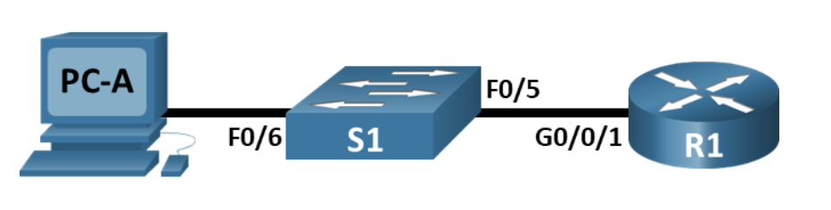

## Таблица адресации

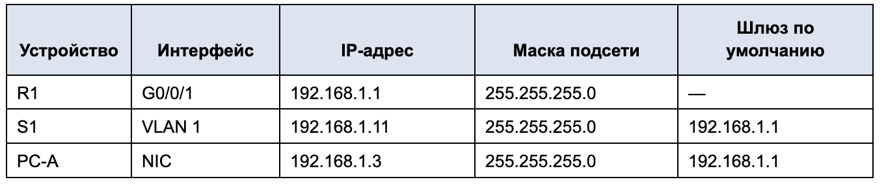

### Часть 1. Настройка основных параметров устройств

#### Шаг 1. Создайте сеть согласно топологии.

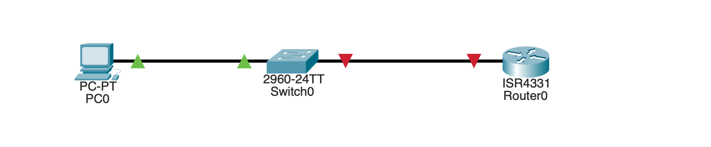

#### Шаг 2. Выполните инициализацию и перезагрузку маршрутизатора и коммутатора.

Switch           |  Router
:-------------------------:|:-------------------------:
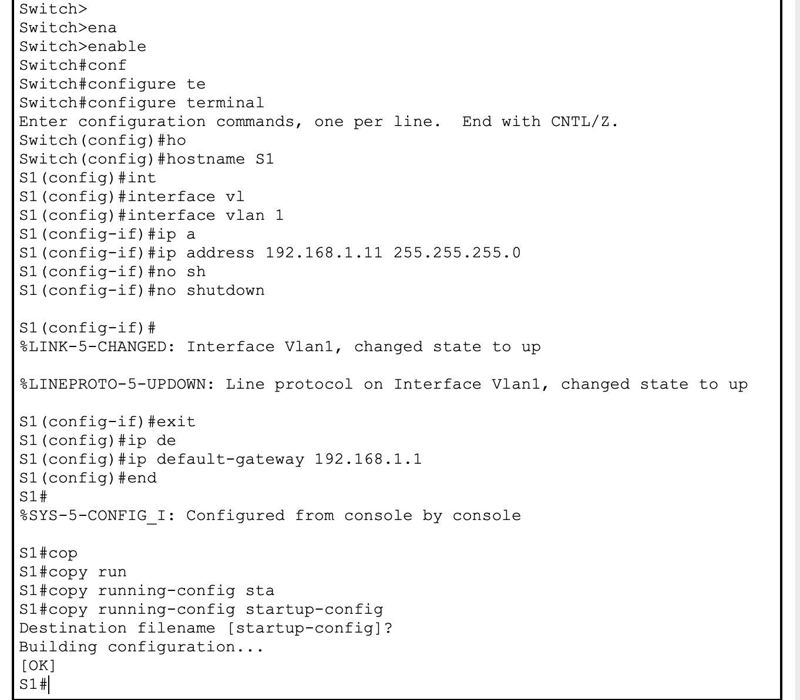  |  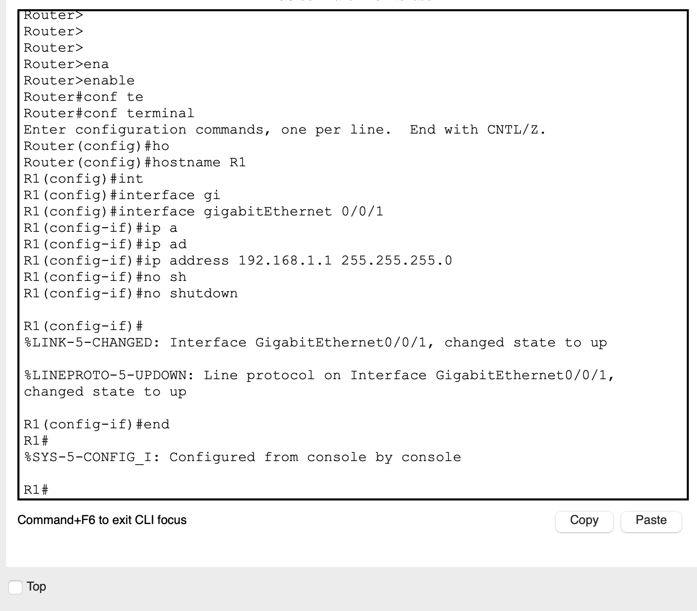

#### Шаг 3. Настройте маршрутизатор.

 CLI 

<pre>

R1>
R1>ena
R1>enable 
R1#con
R1#conf
R1#configure ter
R1#configure terminal 
Enter configuration commands, one per line.  End with CNTL/Z.
R1(config)#no ip do
R1(config)#no ip domain
R1(config)#no ip domain-l
R1(config)#no ip domain-lookup 
R1(config)#se
R1(config)#secr
R1(config)#secre
R1(config)#ena
R1(config)#enable ser
R1(config)#enable secr
R1(config)#enable secret class
R1(config)#lin
R1(config)#line con
R1(config)#line console 0
R1(config-line)#pas
R1(config-line)#password cis
R1(config-line)#password cisco
R1(config-line)#log
R1(config-line)#logi
R1(config-line)#login 
R1(config-line)#exit
R1(config)#inter
R1(config)#interface vt
R1(config)#interface vty
R1(config)#li
R1(config)#lin
R1(config)#line vt
R1(config)#line vty 0 15
R1(config-line)#pas
R1(config-line)#password cisco
R1(config-line)#login
R1(config-line)#exit
R1(config)#login
% Incomplete command.
R1(config)#ser
R1(config)#service pa
R1(config)#service password-encryption 
R1(config)#ban
R1(config)#banner m
R1(config)#banner motd #
Enter TEXT message.  End with the character '#'.
---=== P A S S W O R D ===---
#

R1(config)#int
R1(config)#interface gi
R1(config)#interface gigabitEthernet 0/0/1
R1(config-if)#ip ad
R1(config-if)#ip address 192.168.1.1
% Incomplete command.
R1(config-if)#no sh
R1(config-if)#no shutdown 
R1(config-if)#exit
R1(config)#co
R1(config)#exit
R1#
%SYS-5-CONFIG_I: Configured from console by console

R1#cop
R1#copy run
R1#copy running-config sta
R1#copy running-config startup-config 
Destination filename [startup-config]? 
Building configuration...
[OK]
R1#

</pre>

#### Шаг 4. Настройте компьютер PC-A.

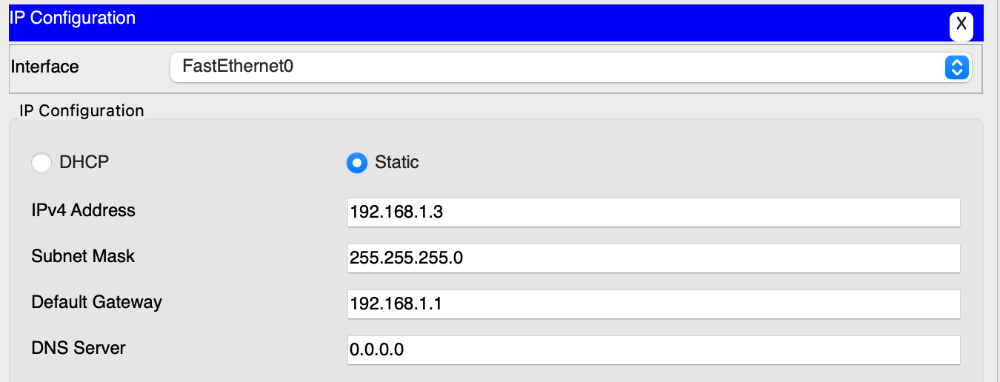

#### Шаг 5. Проверьте подключение к сети.

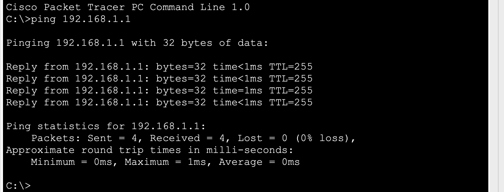

### Часть 2. Настройка маршрутизатора для доступа по протоколу SSH.

#### Шаг 1. Настройте аутентификацию устройств.

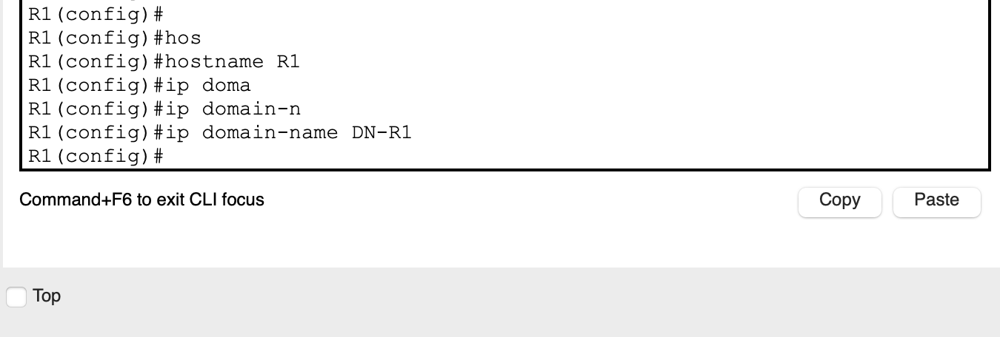

#### Шаг 2. Создайте ключ шифрования с указанием его длины.

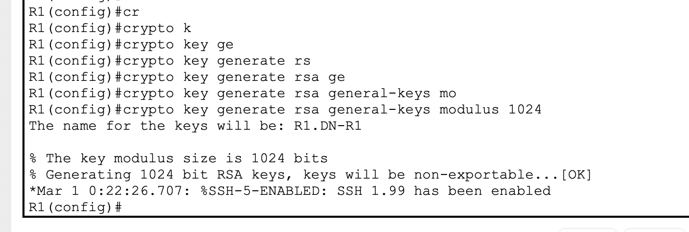

#### Шаг 3. Создайте имя пользователя в локальной базе учетных записей.

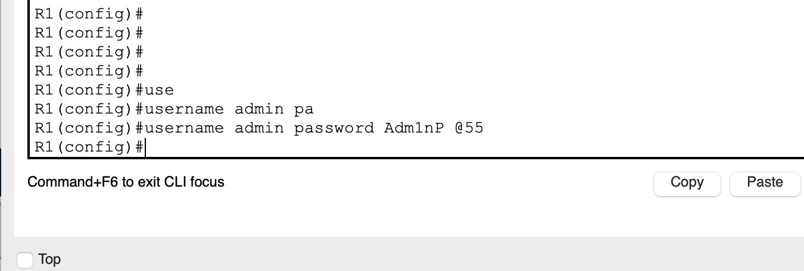

#### Шаг 4. Активируйте протокол SSH на линиях VTY.

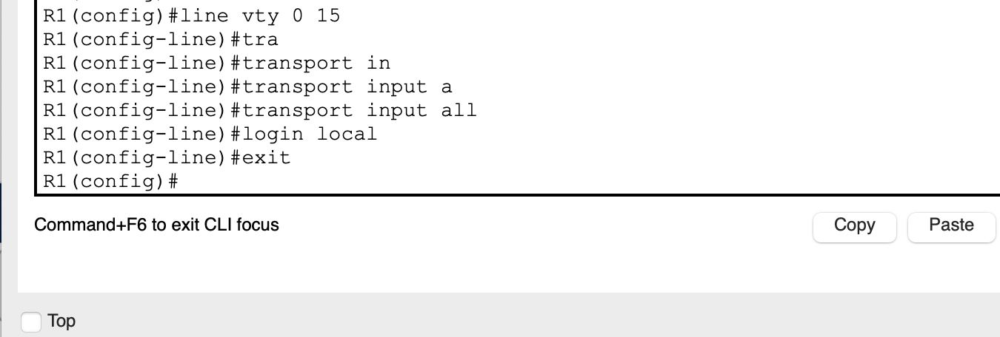

#### Шаг 5. Сохраните текущую конфигурацию в файл загрузочной конфигурации.

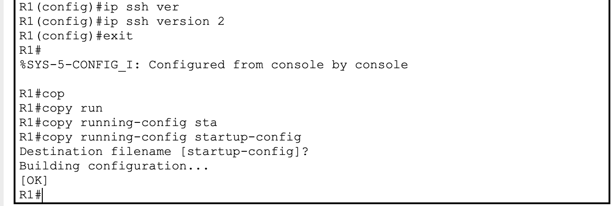

#### Шаг 6. Установите соединение с маршрутизатором по протоколу SSH.

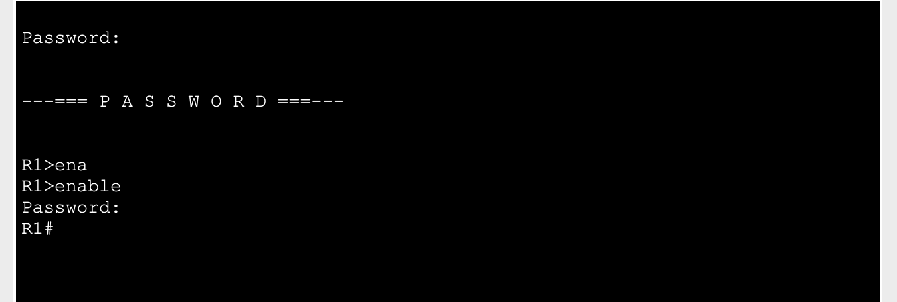

### Часть 3. Настройка коммутатора для доступа по протоколу SSH

#### Шаг 1. Настройте основные параметры коммутатора.

 CLI 

<pre>

S1>
S1>ena
S1>enable 
S1#conf
S1#configure ter
S1#configure terminal 
Enter configuration commands, one per line.  End with CNTL/Z.
S1(config)#no ip domain-lo
S1(config)#no ip domain-lookup 
S1(config)#ena
S1(config)#enable se
S1(config)#enable secret class
S1(config)#con
S1(config)#lin
S1(config)#line con
S1(config)#line console 0
S1(config-line)#pas
S1(config-line)#password cisco
S1(config-line)#login
S1(config-line)#exit
S1(config)#line v
S1(config)#line vty 0 15
S1(config-line)#pa
S1(config-line)#pas
S1(config-line)#password cisco
S1(config-line)#login
S1(config-line)#exit
S1(config)#ser
S1(config)#service pa
S1(config)#service password-encryption 
S1(config)#ba
S1(config)#banner m
S1(config)#banner motd #
Enter TEXT message.  End with the character '#'.
---=== P A S S W O R D ===---
#

S1(config)#inte
S1(config)#interface vl
S1(config)#interface vlan 1
S1(config-if)#ip ad
S1(config-if)#ip address 192.168.1.11 255.255.255
                                      ^
% Invalid input detected at '^' marker.
	
S1(config-if)#ip d
S1(config-if)#ip e
S1(config-if)#ip de
S1(config-if)#exit
S1(config)#ip de
S1(config)#ip default-gateway 192.168.1.1
S1(config)#exit
S1#
%SYS-5-CONFIG_I: Configured from console by console

S1#cop
S1#copy res
S1#copy ru
S1#copy running-config sta
S1#copy running-config startup-config 
Destination filename [startup-config]? 
Building configuration...
[OK]
S1#

</pre>

#### Шаг 2. Настройте коммутатор для соединения по протоколу SSH.

 CLI 

<pre>

S1(config)#ip domain-n
S1(config)#ip domain-name DN-S1
S1(config)#cr
S1(config)#crypto k
S1(config)#crypto key ge
S1(config)#crypto key generate r
S1(config)#crypto key generate rsa g
S1(config)#crypto key generate rsa general-keys m
S1(config)#crypto key generate rsa general-keys modulus 1024
The name for the keys will be: S1.DN-S1

% The key modulus size is 1024 bits
% Generating 1024 bit RSA keys, keys will be non-exportable...[OK]
*Mar 1 0:48:30.476: %SSH-5-ENABLED: SSH 1.99 has been enabled
S1(config)#
S1(config)#ip ss
S1(config)#ip ssh ve
S1(config)#ip ssh version 2
S1(config)#
S1(config)#us
S1(config)#username admin pas
S1(config)#username admin password Admin@P11
S1(config)#lin
S1(config)#line v
S1(config)#line vty 0 15
S1(config-line)#tra
S1(config-line)#transport i
S1(config-line)#transport input all
S1(config-line)#login lo
S1(config-line)#login local 
S1(config-line)#end
S1#
%SYS-5-CONFIG_I: Configured from console by console

S1#

</pre>

#### Шаг 3. Установите соединение с коммутатором по протоколу SSH.

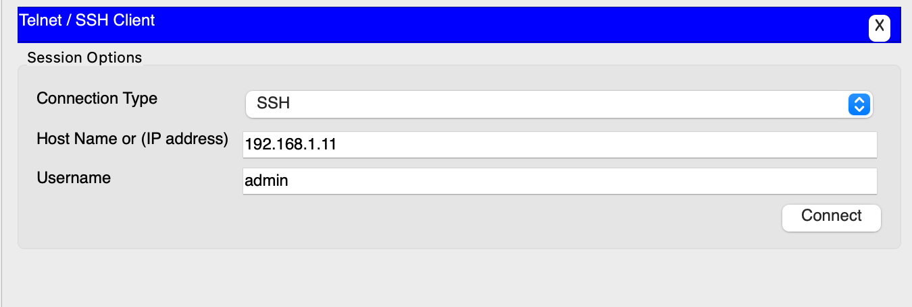

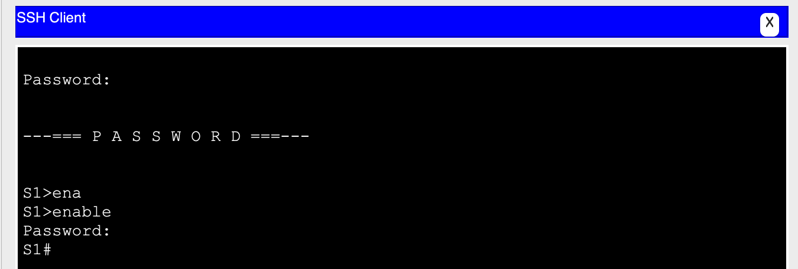

>Удалось ли вам установить SSH-соединение с коммутатором?
>> Да

### Часть 4. Настройка протокола SSH с использованием интерфейса командной строки (CLI) коммутатора

#### Шаг 1. Посмотрите доступные параметры для клиента SSH в Cisco IOS.

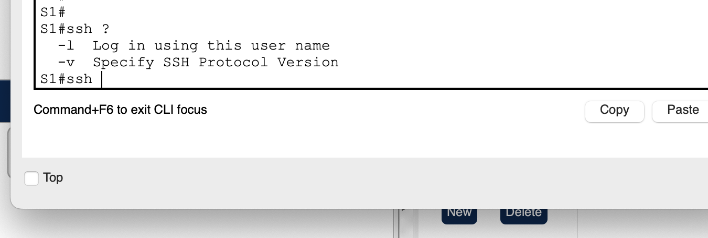

#### Шаг 2. Установите с коммутатора S1 соединение с маршрутизатором R1 по протоколу SSH.

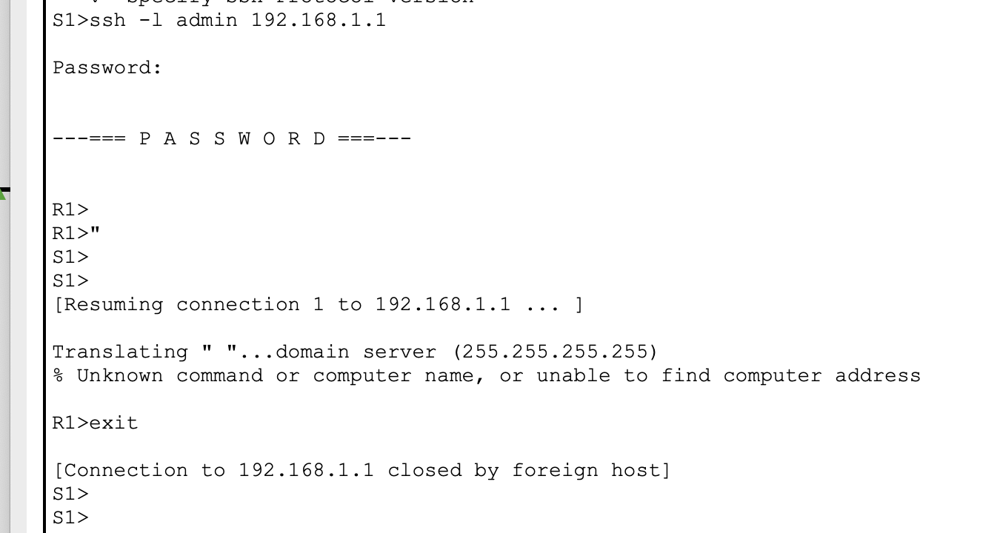

>Какие версии протокола SSH поддерживаются при использовании интерфейса командной строки?
>>1 и 2 версию

>Как предоставить доступ к сетевому устройству нескольким пользователям, у каждого из которых есть собственное имя пользователя?
>>Создать несколько учетных записей пользователей с помощью команды username