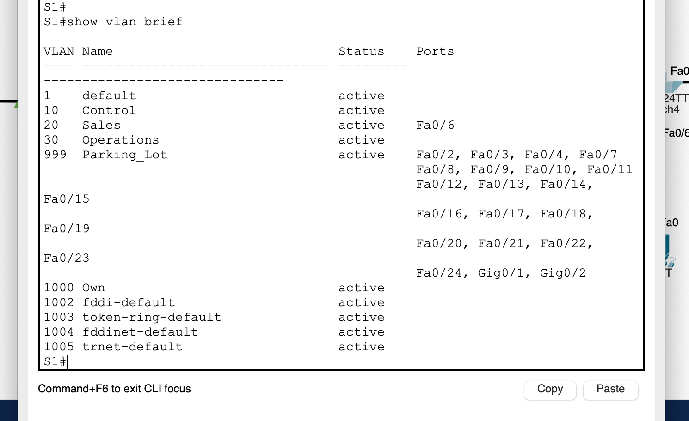
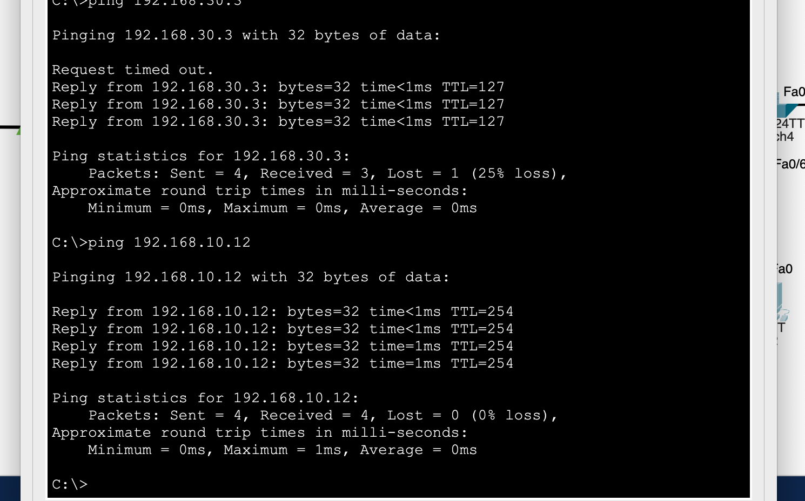

# Лабораторная работа - Внедрение маршрутизации между виртуальными локальными сетями 

## Топология

## Таблица адресации

### Часть 1. Создание сети и настройка основных параметров устройства

#### Шаг 1. Создайте сеть согласно топологии.

#### Шаг 2. Настройте базовые параметры для маршрутизатора

 базовые параметры маршрутизатора 

<pre>

Router>
Router>ena
Router>enable 
Router#conf
Router#configure ter
Router#configure terminal 
Enter configuration commands, one per line.  End with CNTL/Z.
Router(config)#en
Router(config)#ena
Router(config)#enable se
Router(config)#enable secret class
Router(config)#no ip domain-lo
Router(config)#no ip domain-lookup 
Router(config)#line con
Router(config)#line console 0
Router(config-line)#pas
Router(config-line)#password cisco
Router(config-line)#login
Router(config-line)#logg
Router(config-line)#logging sy
Router(config-line)#logging synchronous 
Router(config-line)#exit
Router(config)#lin
Router(config)#line v
Router(config)#line vty 0 4
Router(config-line)#pas
Router(config-line)#password cisco
Router(config-line)#login
Router(config-line)#exit
Router(config)#ser
Router(config)#service en
Router(config)#service pas
Router(config)#service password-encryption 
Router(config)#ban
Router(config)#banner m
Router(config)#ho
Router(config)#hostname R1
R1(config)#ba
R1(config)#banner m
R1(config)#banner motd #
Enter TEXT message.  End with the character '#'.
---=== R1 P A S S W O R D ===---#

R1(config)#exit
R1#
%SYS-5-CONFIG_I: Configured from console by console

R1#cop
R1#copy run
R1#copy running-config str
R1#copy running-config sta
R1#copy running-config startup-config 
Destination filename [startup-config]? 
Building configuration...
[OK]
R1#clo
R1#clock se
R1#clock set 22:00:00 4 march 2024
R1#sho
R1#show clo
R1#show clock 
22:0:4.304 UTC Mon Mar 4 2024
R1#

</pre>

#### Шаг 3. Настройте базовые параметры каждого коммутатора

 базовые параметры коммутатора S1 

<pre>

Switch>
Switch>en
Switch>enable 
Switch#conf
Switch#configure ter
Switch#configure terminal 
Enter configuration commands, one per line.  End with CNTL/Z.
Switch(config)#ho
Switch(config)#hostname S1
S1(config)#no ip domain-lo
S1(config)#no ip domain-lookup 
S1(config)#en
S1(config)#ena
S1(config)#enable se
S1(config)#enable secret class
S1(config)#line con
S1(config)#line console 0
S1(config-line)#pas
S1(config-line)#password cisco
S1(config-line)#login
S1(config-line)#logg
S1(config-line)#logging sy
S1(config-line)#logging synchronous 
S1(config-line)#exit
S1(config)#line v
S1(config)#line vty 0 4
S1(config-line)#pass
S1(config-line)#password cisco
S1(config-line)#login
S1(config-line)#exit
S1(config)#en
S1(config)#ena
S1(config)#enable p
S1(config)#ser
S1(config)#service p
S1(config)#service password-encryption 
S1(config)#ba
S1(config)#banner m
S1(config)#banner motd #
Enter TEXT message.  End with the character '#'.
---=== S1 P A S S W O R D ===---#

S1(config)#clo
S1(config)#clock set 22:00:00 4 march 2024
                 ^
% Invalid input detected at '^' marker.
	
S1(config)#exit
S1#
%SYS-5-CONFIG_I: Configured from console by console

S1#clo
S1#clock se
S1#clock set 22:00:00 4 march 2024
S1#sho
S1#show clock
22:0:3.902 UTC Mon Mar 4 2024
S2#cop
S2#copy run
S2#copy running-config st
S2#copy running-config startup-config 
Destination filename [startup-config]? 
Building configuration...
[OK]
S1#

</pre>

 базовые параметры коммутатора S2 

<pre>

Switch>ena
Switch>enable 
Switch#conf ter
Switch#conf terminal 
Enter configuration commands, one per line.  End with CNTL/Z.
Switch(config)#ena
Switch(config)#enable se
Switch(config)#enable secret class
Switch(config)#no ip domain-lo
Switch(config)#no ip domain-lookup 
Switch(config)#line co
Switch(config)#line console 0
Switch(config-line)#pas
Switch(config-line)#password cisco
Switch(config-line)#login
Switch(config-line)#log
Switch(config-line)#logg
Switch(config-line)#logging s
Switch(config-line)#logging synchronous 
Switch(config-line)#exit
Switch(config)#line vt
Switch(config)#line vty 0 4
Switch(config-line)#pas
Switch(config-line)#password cisco
Switch(config-line)#login
Switch(config-line)#exit
Switch(config)#ser
Switch(config)#service pa
Switch(config)#service password-encryption 
Switch(config)#ba
Switch(config)#banner m
Switch(config)#banner motd #
Enter TEXT message.  End with the character '#'.
---=== S2 P A S S W O R D ===---#

Switch(config)#exit
Switch#
%SYS-5-CONFIG_I: Configured from console by console

Switch#clo
Switch#clock s
Switch#clock set 22:00:00 4 march 2024
Switch#show clock
22:0:5.305 UTC Mon Mar 4 2024
Switch(config)#ho
Switch(config)#hostname S2
S2(config)#exit
S2#
%SYS-5-CONFIG_I: Configured from console by console

S2#cop
S2#copy run
S2#copy running-config st
S2#copy running-config startup-config 
Destination filename [startup-config]? 
Building configuration...
[OK]
S2#

</pre>

#### Шаг 4. Настройте узлы ПК

PC-A(PC0)           |  PC-B(PC1)
:-------------------------:|:-------------------------:
  |  

### Часть 2. Создание сетей VLAN и назначение портов коммутатора

#### Шаг 1. Создайте сети VLAN на коммутаторах

S1          |  S2
:-------------------------:|:-------------------------:
  |  
  |  

#### Шаг 2. Назначьте сети VLAN соответствующим интерфейсам коммутатора

S1          |  S2
:-------------------------:|:-------------------------:
  |  

### Часть 3. Конфигурация магистрального канала стандарта 802.1Q между коммутаторами

#### Шаг 1. Вручную настройте магистральный интерфейс F0/1 на коммутаторах S1 и S2

S1          |  S2
:-------------------------:|:-------------------------:
  |  
  |  

#### Шаг 2. Вручную настройте магистральный интерфейс F0/5 на коммутаторе S1

>Что произойдет, если G0/0/1 на R1 будет отключен
>>отсутсвует связь между маршрутизатором и коммутатором. Не будет связаности VLAN сетей

### Часть 4. Настройка маршрутизации между сетями VLAN

#### Шаг 1. Настройте маршрутизатор

### Часть 5. Проверьте, работает ли маршрутизация между VLAN

#### Шаг 1. Выполните следующие тесты с PC-A. Все должно быть успешно

#### Шаг 2. Пройдите следующий тест с PC-B

>Какие промежуточные IP-адреса отображаются в результатах?
>>Отображаются два адреса 192.168.30.1(Router), 192.168.20.3(PC-A)