# Лабораторная работа - Внедрение маршрутизации между виртуальными локальными сетями 

## Топология

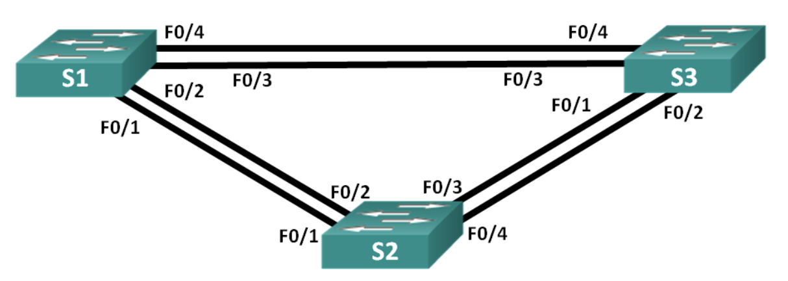

## Таблица адресации

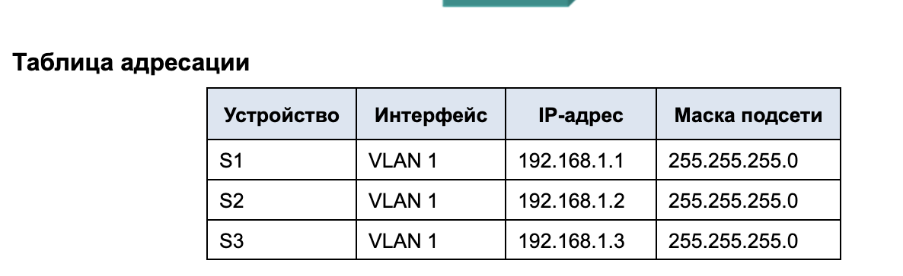

### Часть 1. Создание сети и настройка основных параметров устройства

#### Шаг 1. Создайте сеть согласно топологии

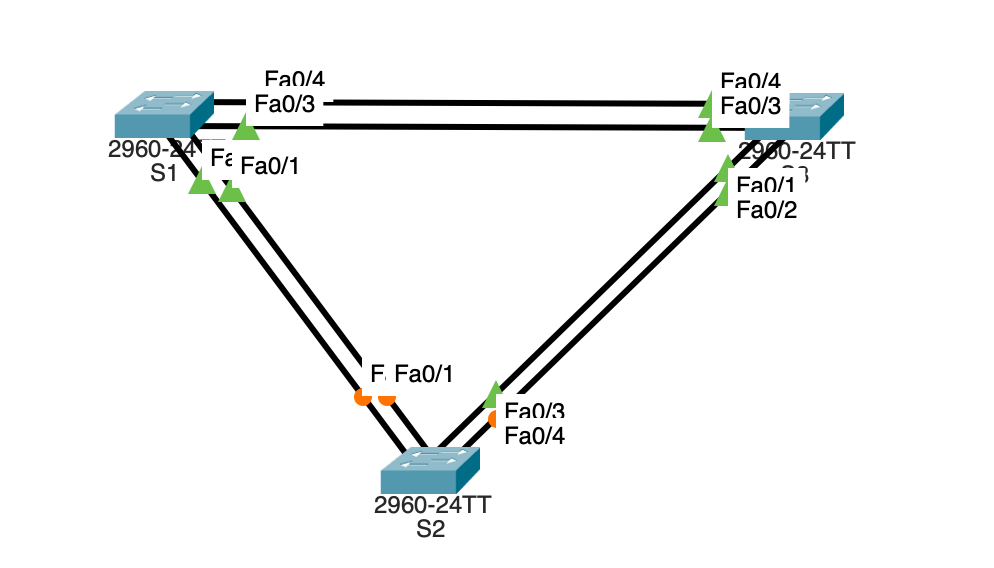

#### Шаг 2. Выполните инициализацию и перезагрузку коммутаторов

#### Шаг 3. Настройте базовые параметры каждого коммутатора

 S1 

<pre>

Switch>
Switch>ena
Switch#conf ter
Enter configuration commands, one per line.  End with CNTL/Z.
Switch(config)#no ip domain-lo
Switch(config)#no ip domain-lookup 
Switch(config)#hos
Switch(config)#hostname S1
S1(config)#en
S1(config)#ena
S1(config)#enable se
S1(config)#enable secret class
S1(config)#con
S1(config)#cons
S1(config)#li
S1(config)#line con
S1(config)#line console 0
S1(config-line)#pas
S1(config-line)#password cisco
S1(config-line)#login
S1(config-line)#logg
S1(config-line)#logging sy
S1(config-line)#logging synchronous 
S1(config-line)#exit
S1(config)#li
S1(config)#line v
S1(config)#line vty 0 4
S1(config-line)#pas
S1(config-line)#password cisco
S1(config-line)#login
S1(config-line)#exit
S1(config)#ba
S1(config)#banner m
S1(config)#banner motd #
Enter TEXT message.  End with the character '#'.
---=== S3 P A S S W O R D ===---#

S1(config)#ser
S1(config)#service pa
S1(config)#service password-encryption 
S1(config)#int
S1(config)#interface vl
S1(config)#interface vlan 1
S1(config-if)#ip ad
S1(config-if)#ip address 192.168.1.1 255.255.255.0
S1(config-if)#no sh
S1(config-if)#no shutdown 

S1(config-if)#
%LINK-5-CHANGED: Interface Vlan1, changed state to up

%LINEPROTO-5-UPDOWN: Line protocol on Interface Vlan1, changed state to up

S1(config-if)#exit
S1(config)#cop
S1(config)#exit
S1#
%SYS-5-CONFIG_I: Configured from console by console

S1#cop
S1#copy run
S1#copy running-config st
S1#copy running-config startup-config 
Destination filename [startup-config]? 
Building configuration...
[OK]
S1#

</pre>

 S2 

<pre>

Switch>
Switch>ena
Switch>enable 
Switch#conf
Switch#configure ter
Switch#configure terminal 
Enter configuration commands, one per line.  End with CNTL/Z.
Switch(config)#no ip domain-lookup
Switch(config)#hostname S2
S2(config)#enable secret class
S2(config)#line console 0
S2(config-line)#password cisco
S2(config-line)#login
S2(config-line)#logging synchronous
S2(config-line)#exit
S2(config)#line vty 0 4
S2(config-line)#password cisco
S2(config-line)#login
S2(config-line)#exit
S2(config)#banner motd #
Enter TEXT message.  End with the character '#'.
---=== S2 P A S S W O R D ===---#

S2(config)#service password-encryption
S2(config)#interface vlan 1
S2(config-if)#ip address 192.168.1.2 255.255.255.0
S2(config-if)#no shutdown

S2(config-if)#
%LINK-5-CHANGED: Interface Vlan1, changed state to up

%LINEPROTO-5-UPDOWN: Line protocol on Interface Vlan1, changed state to up

S2(config-if)#end
S2#
%SYS-5-CONFIG_I: Configured from console by console

S2#copy running-config startup-config
Destination filename [startup-config]? 
Building configuration...
[OK]
S2#

</pre>

 S3 

<pre>

Switch>
Switch>enable
Switch#configure terminal
Enter configuration commands, one per line.  End with CNTL/Z.
Switch(config)#no ip domain-lookup 
Switch(config)#hostname S3
S3(config)#enable secret class
S3(config)#line console 0
S3(config-line)#password cisco
S3(config-line)#login
S3(config-line)#logging synchronous 
S3(config-line)#exit
S3(config)#line vty 0 4
S3(config-line)#password cisco
S3(config-line)#login
S3(config-line)#exit
S3(config)#banner motd #
Enter TEXT message.  End with the character '#'.
---=== S3 P A S S W O R D ===---#

S3(config)#service password-encryption 
S3(config)#interface vlan 1
S1(config-if)#ip address 192.168.1.3 255.255.255.0
S3(config-if)#no shutdown 

S3(config-if)#
%LINK-5-CHANGED: Interface Vlan1, changed state to up

%LINEPROTO-5-UPDOWN: Line protocol on Interface Vlan1, changed state to up

S3(config-if)#end
S3#
%SYS-5-CONFIG_I: Configured from console by console

S3#copy running-config startup-config 
Destination filename [startup-config]? 
Building configuration...
[OK]
S3#

</pre>

#### Шаг 4. Проверьте связь

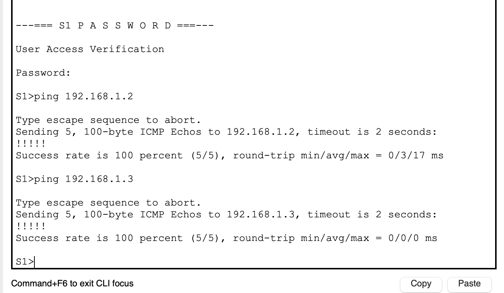

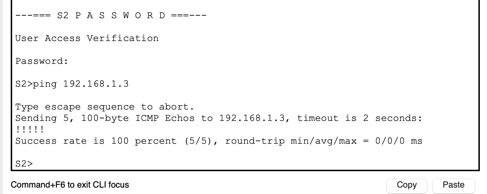

### Часть 2. Определение корневого моста

#### Шаг 1. Отключите все порты на коммутаторах

 shutdown ports 

<pre>

enable
Password: 
#configure terminal
Enter configuration commands, one per line.  End with CNTL/Z.
(config)#interface range fastEthernet 0/1-5
(config-if-range)#shutdown

%LINK-5-CHANGED: Interface FastEthernet0/5, changed state to administratively down
S1(config-if-range)#
%LINK-5-CHANGED: Interface FastEthernet0/1, changed state to administratively down

%LINEPROTO-5-UPDOWN: Line protocol on Interface FastEthernet0/1, changed state to down

%LINK-5-CHANGED: Interface FastEthernet0/2, changed state to administratively down

%LINEPROTO-5-UPDOWN: Line protocol on Interface FastEthernet0/2, changed state to down

%LINK-5-CHANGED: Interface FastEthernet0/3, changed state to administratively down

%LINEPROTO-5-UPDOWN: Line protocol on Interface FastEthernet0/3, changed state to down

%LINK-5-CHANGED: Interface FastEthernet0/4, changed state to administratively down

%LINEPROTO-5-UPDOWN: Line protocol on Interface FastEthernet0/4, changed state to down

%LINEPROTO-5-UPDOWN: Line protocol on Interface Vlan1, changed state to down

</pre>

#### Шаг 2. Отключите все порты на коммутаторах

 trunk 

<pre>

enable
Password: 
#configure terminal
Enter configuration commands, one per line.  End with CNTL/Z.
(config)#interface range fastEthernet 0/1-4
(config-if-range)#switchport mode trunk 
(config-if-range)#switchport trunk allowed vlan 1

</pre>

#### Шаг 3. Включите порты F0/2 и F0/4 на всех коммутаторах

 f0/2 f0/4 

<pre>

enable
Password: 
#configure terminal
Enter configuration commands, one per line.  End with CNTL/Z.
(config)#interface fastEthernet 0/2
(config-if)#no shutdown 

%LINK-5-CHANGED: Interface FastEthernet0/2, changed state to down
(config-if)#exit
(config)#interface fastEthernet 0/4
(config-if)#no shutdown 

%LINK-5-CHANGED: Interface FastEthernet0/4, changed state to down

</pre>

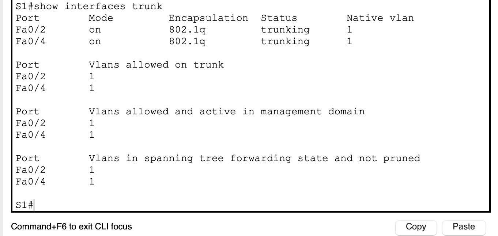

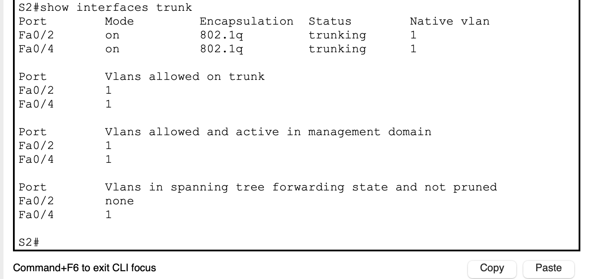

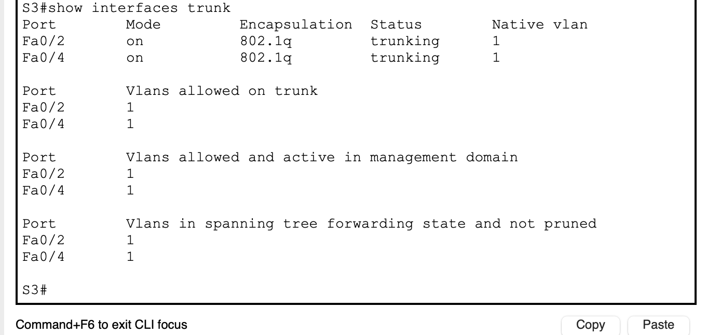

#### Шаг 4. Отобразите данные протокола spanning-tree

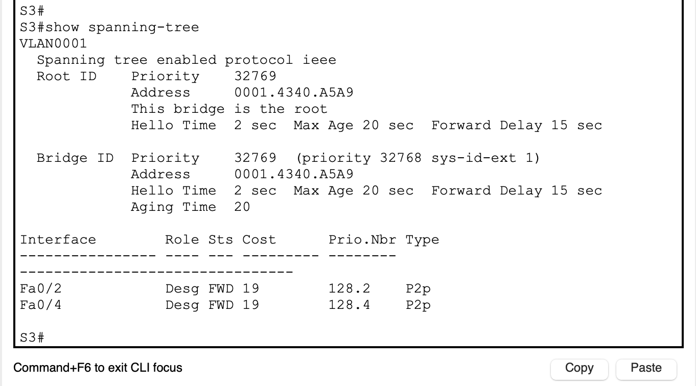

> Какой коммутатор является корневым мостом?
>> S3

> Почему этот коммутатор был выбран протоколом spanning-tree в качестве корневого моста?
>> Корневой мост выбирается по с самым низким BID (Root ID). Но поскольку данный параметр не редактировался, то на всех коммутаторах он одинаковый, и корневой мост выбран случайно среди равных.

> Какие порты на коммутаторе являются корневыми портами?
>> S1 - F0/4; S2 - F0/4

> Какие порты на коммутаторе являются назначенными портами?
>> S1 - F0/2; S3 - F0/2, F0/4

> Какой порт отображается в качестве альтернативного и в настоящее время заблокирован? 
>> S2 - F0/2

> Почему протокол spanning-tree выбрал этот порт в качестве невыделенного (заблокированного) порта?
>> Данный порт не был выбран в качестве корневого или назначенного порта. Т.к. в сумме параметров (приоритета , стоимости) данный порт является наихудшим.

### Часть 3. Наблюдение за процессом выбора протоколом STP порта, исходя из стоимости портов

#### Шаг 1. Определите коммутатор с заблокированным портом

#### Шаг 2. Измените стоимость порта

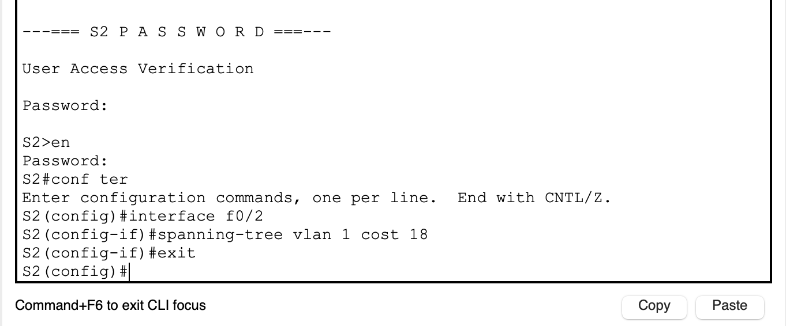

#### Шаг 3. Просмотрите изменения протокола spanning-tree

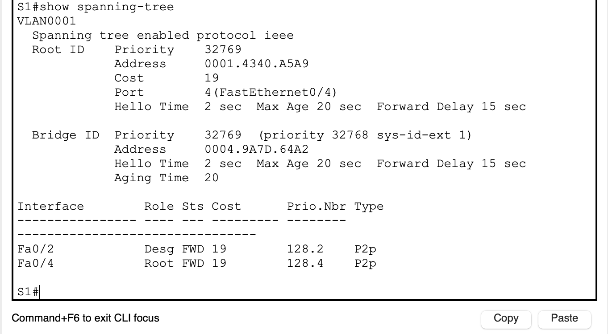

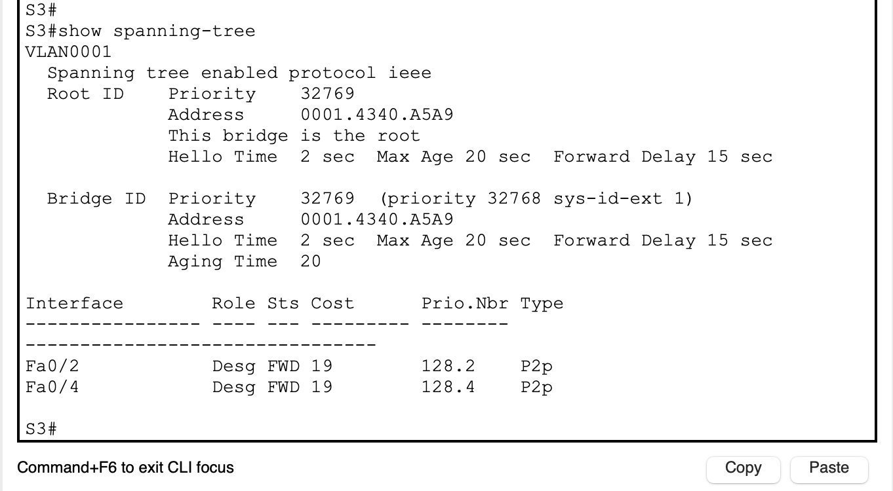

> Почему протокол spanning-tree заменяет ранее заблокированный порт на назначенный порт и блокирует порт, который был назначенным портом на другом коммутаторе?
>> Изменилась стоимость порта, поэтому STP пересчитывает маршрут и определяет оптимальный путь.

#### Шаг 4. Удалите изменения стоимости порта

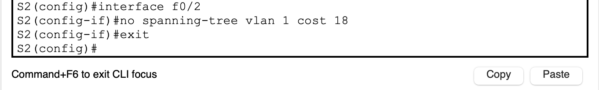

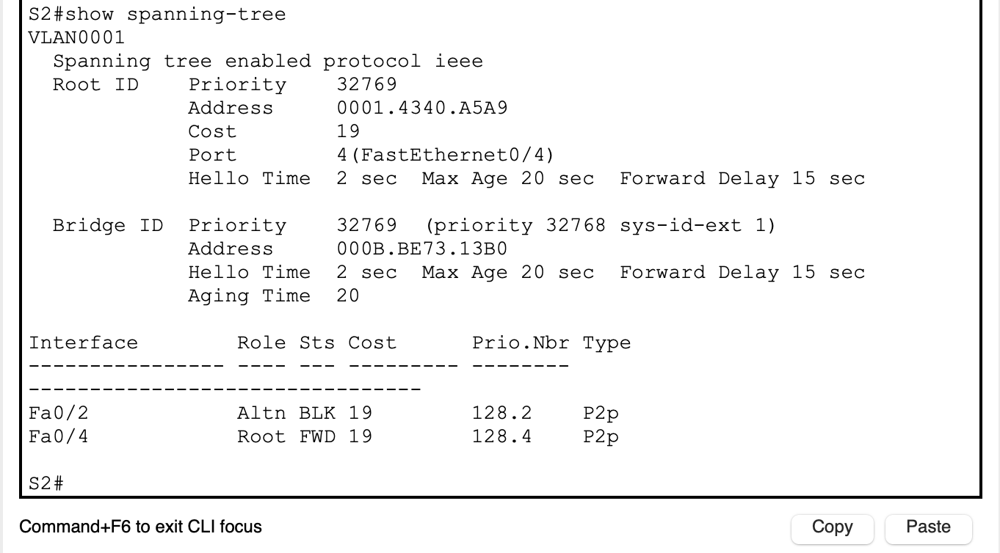

### Часть 4. Наблюдение за процессом выбора протоколом STP порта, исходя из приоритета портов

 f0/1 f0/3 

<pre>

enable
Password: 
#configure terminal
Enter configuration commands, one per line.  End with CNTL/Z.
(config)#interface fastEthernet 0/1
(config-if)#no shutdown 

%LINK-5-CHANGED: Interface FastEthernet0/1, changed state to down
(config-if)#exit
(config)#interface fastEthernet 0/3
(config-if)#no shutdown 

%LINK-5-CHANGED: Interface FastEthernet0/3, changed state to down
(config-if)#exit
(config)#

</pre>

###### show interfaces trunk

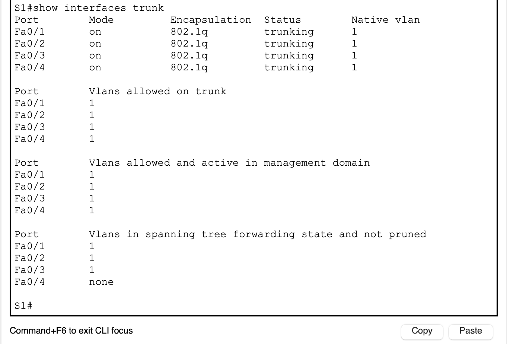

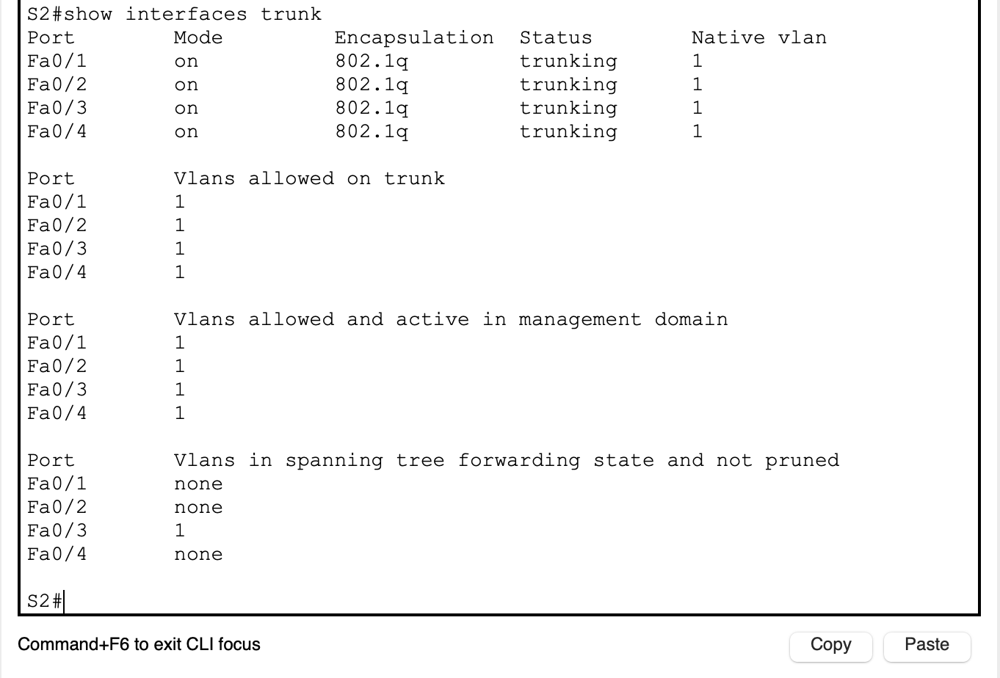

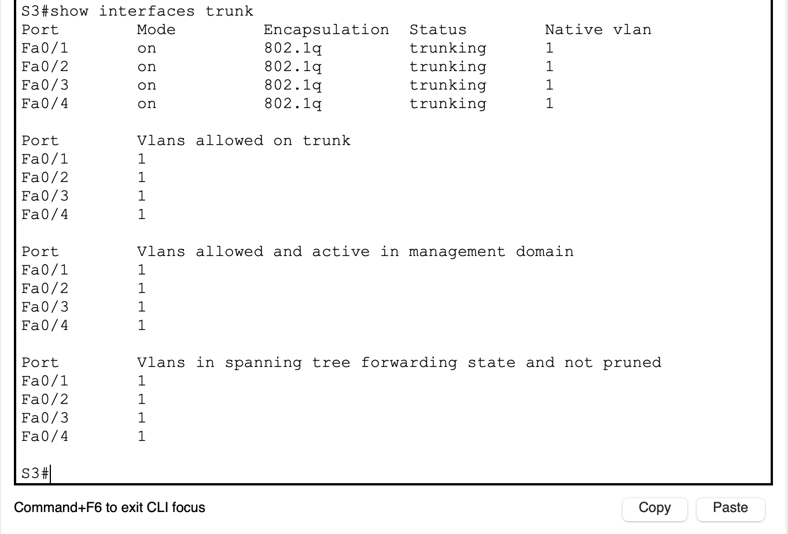

###### show spanning-tree

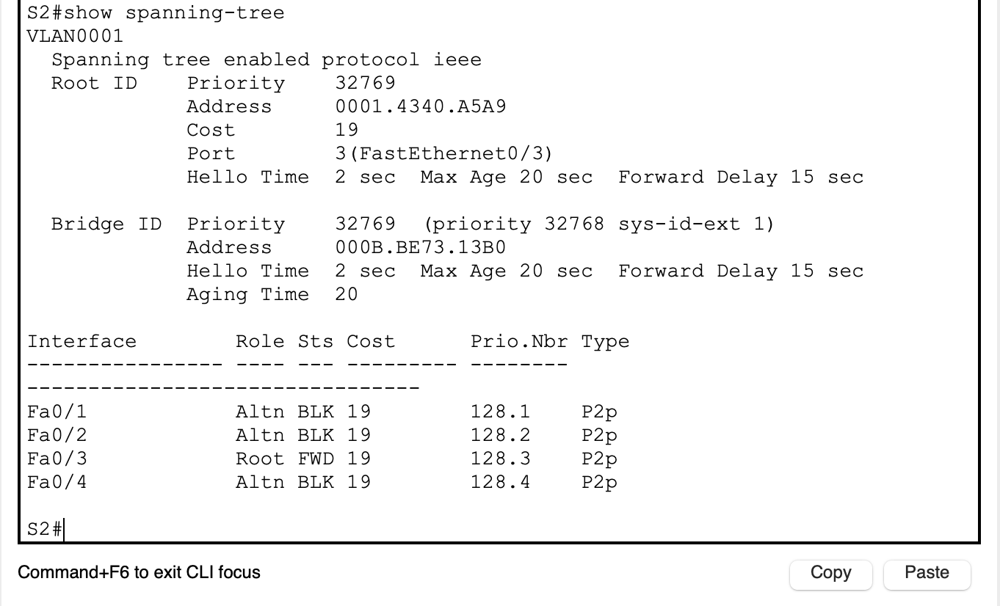

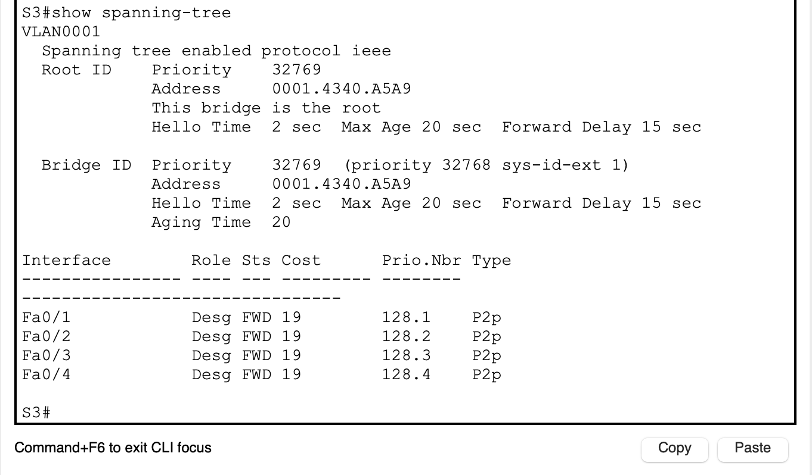

> Какой порт выбран протоколом STP в качестве порта корневого моста на каждом коммутаторе некорневого моста?
>> S1 - F0/3; S2 - F0/3

> Почему протокол STP выбрал эти порты в качестве портов корневого моста на этих коммутаторах?
>> Среди портов подключеных к корневому мосту, они имеют самый низкий приоритет

### Вопросы для повторения

> Какое значение протокол STP использует первым после выбора корневого моста, чтобы определить выбор порта?
>> Использует значение Priority

> Если первое значение на двух портах одинаково, какое следующее значение будет использовать протокол STP при выборе порта?
>> Использует значение cost

> Если оба значения на двух портах равны, каким будет следующее значение, которое использует протокол STP при выборе порта?
>> Использует значение Prio.Nbr
