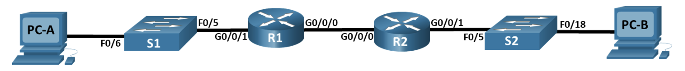
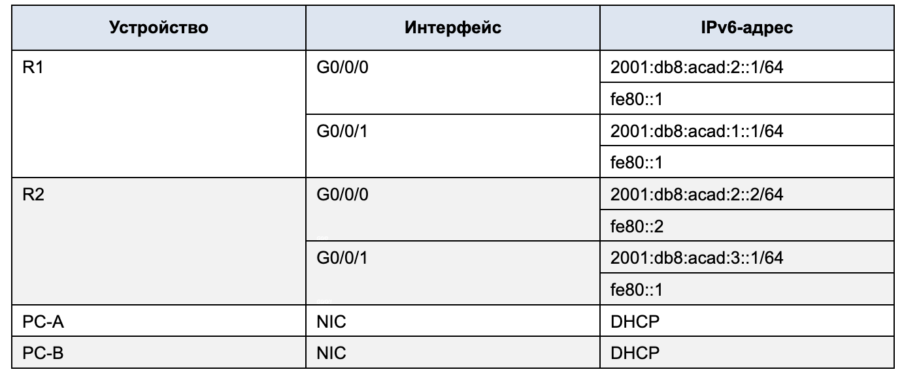
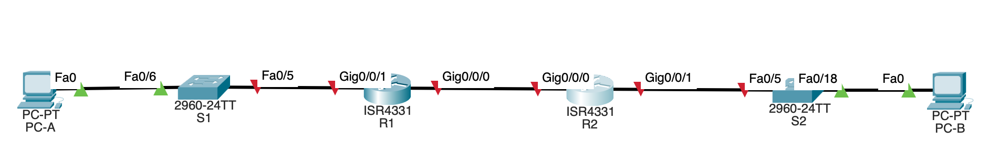
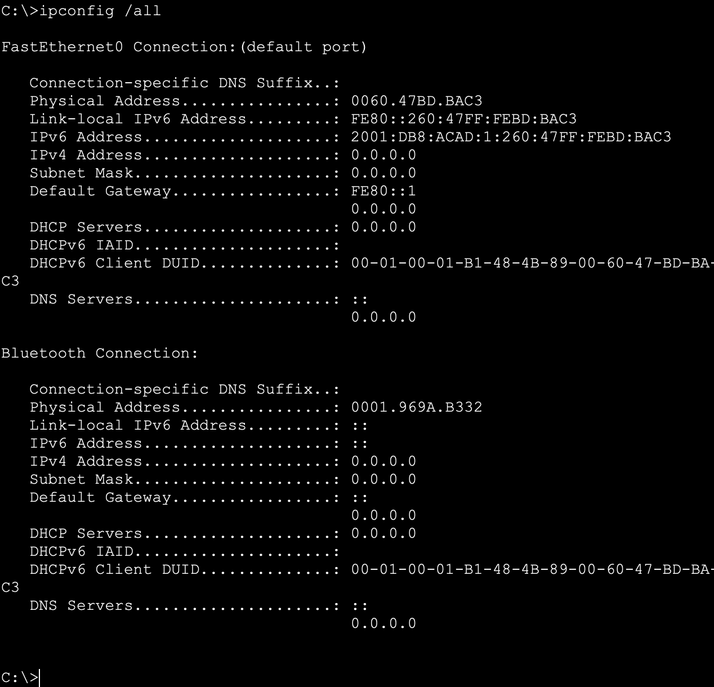
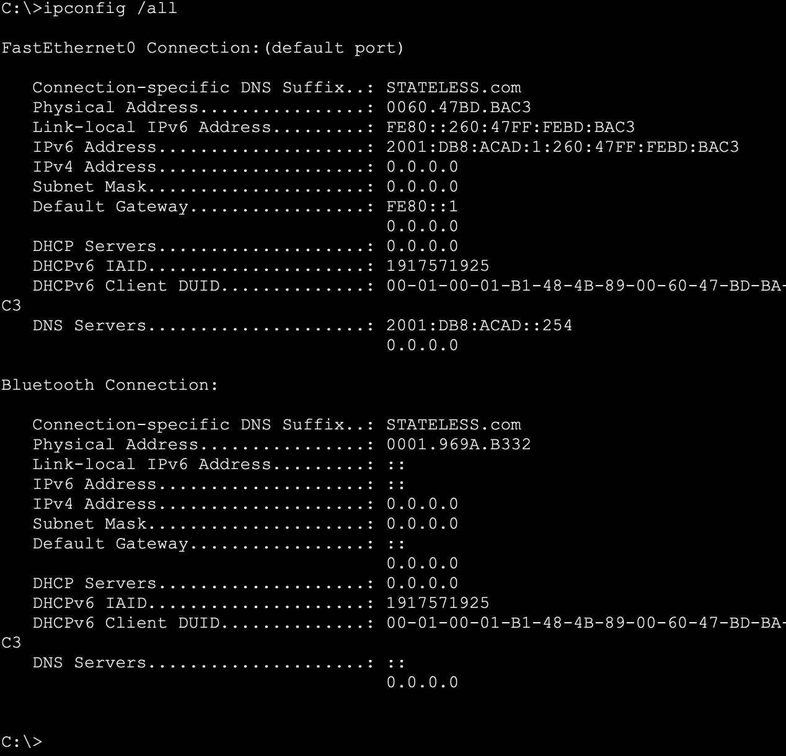
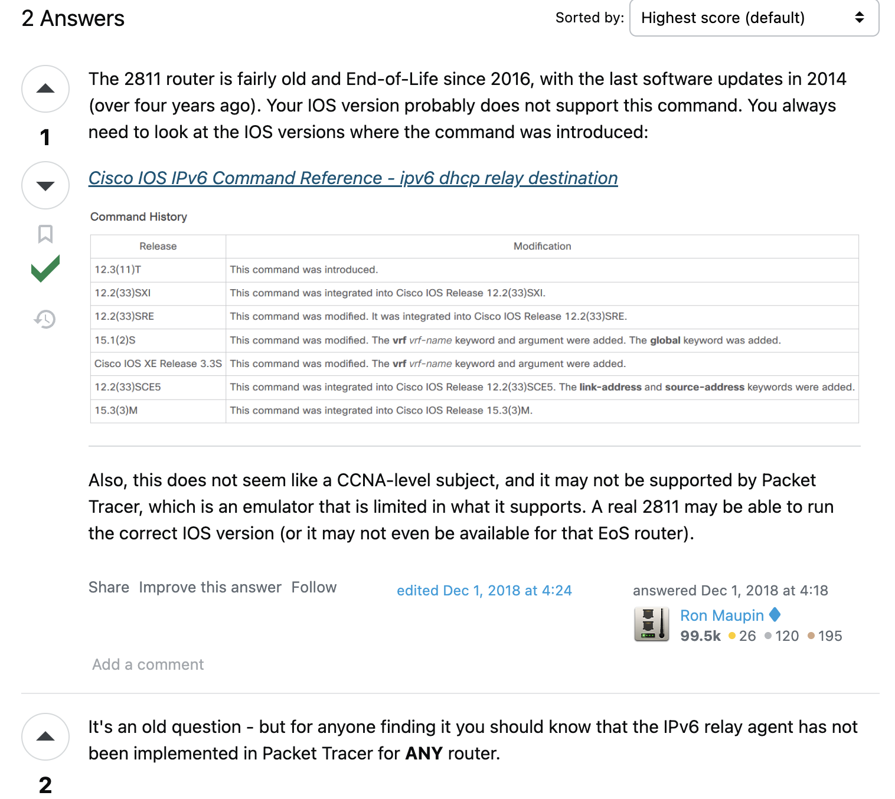
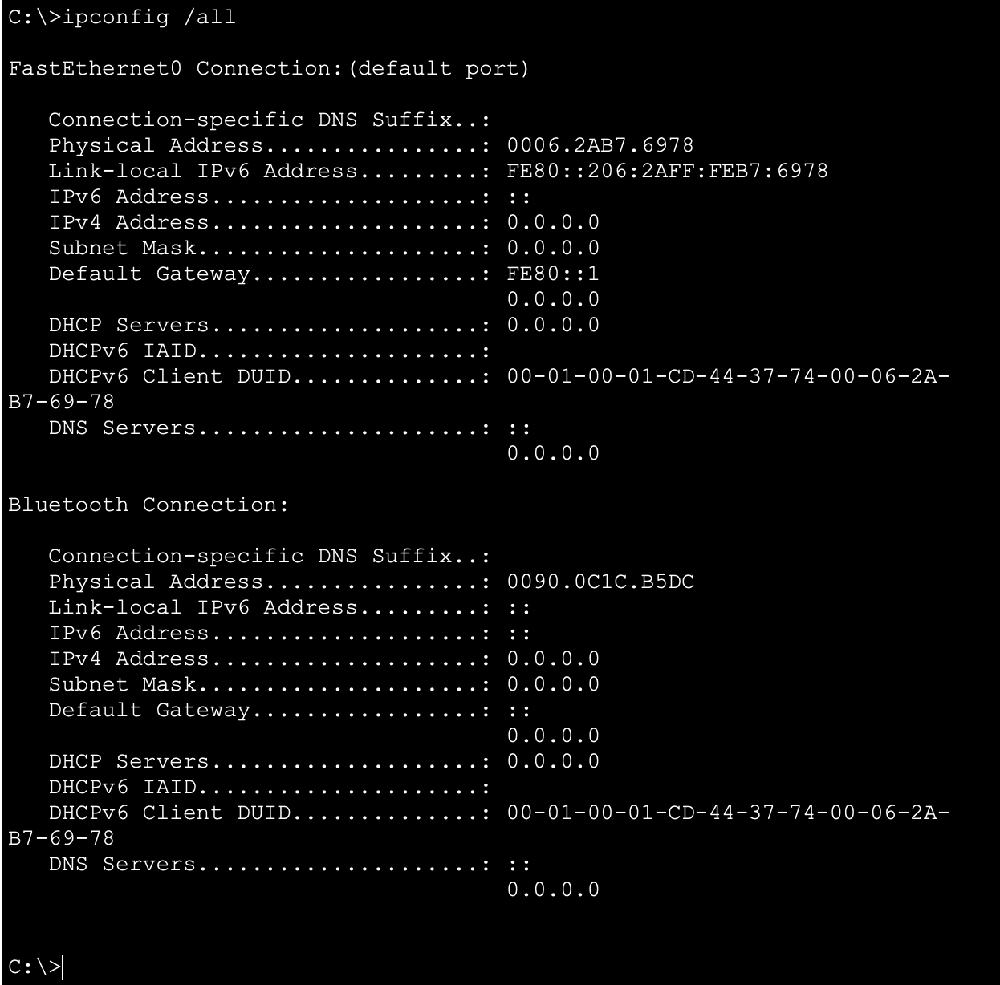

# Лабораторная работа - Настройка DHCPv6

## Топология

## Таблица адресации

### Часть 1. Создание сети и настройка основных параметров устройства

#### Шаг 1. Создайте сеть согласно топологии

#### Шаг 2. Настройте базовые параметры каждого коммутатора. (необязательно)

</pre>

 S1 

<pre>

Switch>
Switch>enable
Switch#configure terminal
Enter configuration commands, one per line.  End with CNTL/Z.
Switch(config)#no ip domain-lookup
Switch(config)#hostname S1
S1(config)#enable secret class
S1(config)#line console 0
S1(config-line)#password cisco
S1(config-line)#login
S1(config-line)#logging synchronous 
S1(config-line)#exit
S1(config)#line vty 0 4
S1(config-line)#password cisco
S1(config-line)#login
S1(config-line)#exit
S1(config)#banner motd #
Enter TEXT message.  End with the character '#'.
---=== S1 P A S S W O R D ===---#

S1(config)#service password-encryption 
S1(config)#interface range f0/1-4, f0/7-24, g0/1-2
S1(config-if-range)#shutdown

%LINK-5-CHANGED: Interface FastEthernet0/1, changed state to administratively down

%LINK-5-CHANGED: Interface FastEthernet0/2, changed state to administratively down

%LINK-5-CHANGED: Interface FastEthernet0/3, changed state to administratively down

%LINK-5-CHANGED: Interface FastEthernet0/4, changed state to administratively down

%LINK-5-CHANGED: Interface FastEthernet0/7, changed state to administratively down

%LINK-5-CHANGED: Interface FastEthernet0/8, changed state to administratively down

%LINK-5-CHANGED: Interface FastEthernet0/9, changed state to administratively down

%LINK-5-CHANGED: Interface FastEthernet0/10, changed state to administratively down

%LINK-5-CHANGED: Interface FastEthernet0/11, changed state to administratively down

%LINK-5-CHANGED: Interface FastEthernet0/12, changed state to administratively down

%LINK-5-CHANGED: Interface FastEthernet0/13, changed state to administratively down

%LINK-5-CHANGED: Interface FastEthernet0/14, changed state to administratively down

%LINK-5-CHANGED: Interface FastEthernet0/15, changed state to administratively down

%LINK-5-CHANGED: Interface FastEthernet0/16, changed state to administratively down

%LINK-5-CHANGED: Interface FastEthernet0/17, changed state to administratively down

%LINK-5-CHANGED: Interface FastEthernet0/18, changed state to administratively down

%LINK-5-CHANGED: Interface FastEthernet0/19, changed state to administratively down

%LINK-5-CHANGED: Interface FastEthernet0/20, changed state to administratively down

%LINK-5-CHANGED: Interface FastEthernet0/21, changed state to administratively down

%LINK-5-CHANGED: Interface FastEthernet0/22, changed state to administratively down

%LINK-5-CHANGED: Interface FastEthernet0/23, changed state to administratively down

%LINK-5-CHANGED: Interface FastEthernet0/24, changed state to administratively down

%LINK-5-CHANGED: Interface GigabitEthernet0/1, changed state to administratively down

%LINK-5-CHANGED: Interface GigabitEthernet0/2, changed state to administratively down
S1(config-if-range)#end
S1#
%SYS-5-CONFIG_I: Configured from console by console

S1#copy running-config startup-config
Destination filename [startup-config]? 
Building configuration...
[OK]
S1#

</pre>

</pre>

 S2 

<pre>

Switch>
Switch>enable
Switch#configure terminal
Enter configuration commands, one per line.  End with CNTL/Z.
Switch(config)#no ip domain-lookup
Switch(config)#hostname S2
S2(config)#enable secret class
S2(config)#line console 0
S2(config-line)#password cisco
S2(config-line)#login
S2(config-line)#logging synchronous 
S2(config-line)#exit
S2(config)#line vty 0 4
S2(config-line)#password cisco
S2(config-line)#login
S2(config-line)#exit
S2(config)#banner motd #
Enter TEXT message.  End with the character '#'.
---=== S2 P A S S W O R D ===---#

S2(config)#service password-encryption 
S2(config)#interface range f0/1-4, f0/7-24, g0/1-2
S2(config-if-range)#shutdown

%LINK-5-CHANGED: Interface FastEthernet0/1, changed state to administratively down

%LINK-5-CHANGED: Interface FastEthernet0/2, changed state to administratively down

%LINK-5-CHANGED: Interface FastEthernet0/3, changed state to administratively down

%LINK-5-CHANGED: Interface FastEthernet0/4, changed state to administratively down

%LINK-5-CHANGED: Interface FastEthernet0/6, changed state to administratively down

%LINK-5-CHANGED: Interface FastEthernet0/7, changed state to administratively down

%LINK-5-CHANGED: Interface FastEthernet0/8, changed state to administratively down

%LINK-5-CHANGED: Interface FastEthernet0/9, changed state to administratively down

%LINK-5-CHANGED: Interface FastEthernet0/10, changed state to administratively down

%LINK-5-CHANGED: Interface FastEthernet0/11, changed state to administratively down

%LINK-5-CHANGED: Interface FastEthernet0/12, changed state to administratively down

%LINK-5-CHANGED: Interface FastEthernet0/13, changed state to administratively down

%LINK-5-CHANGED: Interface FastEthernet0/14, changed state to administratively down

%LINK-5-CHANGED: Interface FastEthernet0/15, changed state to administratively down

%LINK-5-CHANGED: Interface FastEthernet0/16, changed state to administratively down

%LINK-5-CHANGED: Interface FastEthernet0/17, changed state to administratively down

%LINK-5-CHANGED: Interface FastEthernet0/19, changed state to administratively down

%LINK-5-CHANGED: Interface FastEthernet0/20, changed state to administratively down

%LINK-5-CHANGED: Interface FastEthernet0/21, changed state to administratively down

%LINK-5-CHANGED: Interface FastEthernet0/22, changed state to administratively down

%LINK-5-CHANGED: Interface FastEthernet0/23, changed state to administratively down

%LINK-5-CHANGED: Interface FastEthernet0/24, changed state to administratively down

%LINK-5-CHANGED: Interface GigabitEthernet0/1, changed state to administratively down

%LINK-5-CHANGED: Interface GigabitEthernet0/2, changed state to administratively down
S2(config-if-range)#end
S2#
%SYS-5-CONFIG_I: Configured from console by console

S2#copy running-config startup-config
Destination filename [startup-config]? 
Building configuration...
[OK]
S2#

</pre>

#### Шаг 3. Произведите базовую настройку маршрутизаторов

</pre>

 R1 

<pre>

Router>enable
Router#configure terminal
Enter configuration commands, one per line.  End with CNTL/Z.
Router(config)#no ip domain-lookup
Router(config)#hostname R1
R1(config)#enable secret class
R1(config)#line console 0
R1(config-line)#password cisco
R1(config-line)#login
R1(config-line)#logging synchronous 
R1(config-line)#exit
R1(config)#line vty 0 4
R1(config-line)#password cisco
R1(config-line)#login
R1(config-line)#exit
R1(config)#banner motd #
Enter TEXT message.  End with the character '#'.
---=== R1 P A S S W O R D ===---#

R1(config)#service password-encryption 
R1(config)#ipv6 unicast-routing
R1(config)#end
R1#
%SYS-5-CONFIG_I: Configured from console by console

R1#copy running-config startup-config
Destination filename [startup-config]? 
Building configuration...
[OK]
R1#

</pre>

</pre>

 R2 

<pre>

Router>enable
Router#configure terminal
Enter configuration commands, one per line.  End with CNTL/Z.
Router(config)#no ip domain-lookup
Router(config)#hostname R2
R2(config)#enable secret class
R2(config)#line console 0
R2(config-line)#password cisco
R2(config-line)#login
R2(config-line)#logging synchronous 
R2(config-line)#exit
R2(config)#line vty 0 4
R2(config-line)#password cisco
R2(config-line)#login
R2(config-line)#exit
R2(config)#banner motd #
Enter TEXT message.  End with the character '#'.
---=== R2 P A S S W O R D ===---#

R2(config)#service password-encryption 
R2(config)#ipv6 unicast-routing
R2(config)#end
R2#
%SYS-5-CONFIG_I: Configured from console by console

R2#copy running-config startup-config
Destination filename [startup-config]? 
Building configuration...
[OK]
R2#

</pre>

#### Шаг 4. Настройка интерфейсов и маршрутизации для обоих маршрутизаторов

</pre>

 R1 

<pre>

R1#configure terminal 
Enter configuration commands, one per line.  End with CNTL/Z.
R1(config)#interface g0/0/1
R1(config-if)#ipv6 address 2001:db8:acad:1::1/64
R1(config-if)#ipv6 address fe80::1 link-local 
R1(config-if)#no shutdown 

R1(config-if)#
%LINK-5-CHANGED: Interface GigabitEthernet0/0/1, changed state to up

%LINEPROTO-5-UPDOWN: Line protocol on Interface GigabitEthernet0/0/1, changed state to up

R1(config-if)#exit
R1(config)#interface g0/0/0
R1(config-if)#ipv6 address 2001:db8:acad:2::1/64
R1(config-if)#ipv6 address fe80::1 link-local
R1(config-if)#no shutdown 

R1(config-if)#
%LINK-5-CHANGED: Interface GigabitEthernet0/0/0, changed state to up

R2(config-if)#exit
R1(config)ipv6 route 2001:db8:acad:3::1/64 2001:db8:acad:2::2
R1(config)#end
R1#
%SYS-5-CONFIG_I: Configured from console by console

R1#wr
Building configuration...
[OK]
R1#show ipv6 interface brief 
GigabitEthernet0/0/0       [up/up]
    FE80::1
    2001:DB8:ACAD:2::1
GigabitEthernet0/0/1       [up/up]
    FE80::1
    2001:DB8:ACAD:1::1
GigabitEthernet0/0/2       [administratively down/down]
    unassigned
Vlan1                      [administratively down/down]
    unassigned
R1#

</pre>

 R2 

<pre>

R2#configure terminal 
Enter configuration commands, one per line.  End with CNTL/Z.
R2(config)#interface g0/0/0
R2(config-if)#ipv6 address 2001:db8:acad:2::2/64
R2(config-if)#ipv6 address fe80::2 link-local 
R2(config-if)#no shutdown 

R2(config-if)#
%LINK-5-CHANGED: Interface GigabitEthernet0/0/0, changed state to up

%LINEPROTO-5-UPDOWN: Line protocol on Interface GigabitEthernet0/0/0, changed state to up

R2(config-if)#exit
R2(config)#interface g0/0/1
R2(config-if)#ipv6 address 2001:db8:acad:3::1/64
R2(config-if)#ipv6 address fe80::1 link-local 
R2(config-if)#no shutdown 

R2(config-if)#
%LINK-5-CHANGED: Interface GigabitEthernet0/0/1, changed state to up

%LINEPROTO-5-UPDOWN: Line protocol on Interface GigabitEthernet0/0/1, changed state to up

R2(config-if)#exit
R2(config)ipv6 route 2001:db8:acad:1::1/64 2001:db8:acad:2::1
R2(config)#exit
R2#wr
Building configuration...
[OK]
R2#show ipv6 interface brief 
GigabitEthernet0/0/0       [up/up]
    FE80::2
    2001:DB8:ACAD:2::2
GigabitEthernet0/0/1       [up/up]
    FE80::1
    2001:DB8:ACAD:3::1
GigabitEthernet0/0/2       [administratively down/down]
    unassigned
Vlan1                      [administratively down/down]
    unassigned
R2#

</pre>

 Ping 

<pre>

R1#ping 2001:db8:acad:3::1

Type escape sequence to abort.
Sending 5, 100-byte ICMP Echos to 2001:db8:acad:3::1, timeout is 2 seconds:
!!!!!
Success rate is 100 percent (5/5), round-trip min/avg/max = 0/0/0 ms

R1#

</pre>

### Часть 2. Проверка назначения адреса SLAAC от R1

> Откуда взялась часть адреса с идентификатором хоста?
>> Поскольку была выбрана автоматическое получение адреса IPv6 узел использовал сообщение Router Advertisement (RA) протокола управления сообщениями Internet Control Message Protocol версии 6 (ICMPv6),

### Часть 3. Настройка и проверка сервера DHCPv6 на R1

#### Шаг 1. Более подробно изучите конфигурацию PC-A.

#### Шаг 2. Настройте R1 для предоставления DHCPv6 без состояния для PC-A.

 R1 

<pre>

R1#configure terminal 
Enter configuration commands, one per line.  End with CNTL/Z.
R1(config)#ipv6 dhcp pool R1-STATELESS
R1(config-dhcpv6)#dns-server 2001:db8:acad::254
R1(config-dhcpv6)#domain-name STATELESS.com
R1(config-dhcpv6)#exit
R1(config)#interface g0/0/1
R1(config-if)#ipv6 nd other-config-flag
R1(config-if)#ipv6 dhcp server R1-STATELESS
R1(config-if)#end
R1#
%SYS-5-CONFIG_I: Configured from console by console

R1#wr
Building configuration...
[OK]
R1#

</pre>

 Ping 

<pre>

C:\>ping 2001:db8:acad:3::1

Pinging 2001:db8:acad:3::1 with 32 bytes of data:

Reply from 2001:DB8:ACAD:3::1: bytes=32 time<1ms TTL=254
Reply from 2001:DB8:ACAD:3::1: bytes=32 time<1ms TTL=254
Reply from 2001:DB8:ACAD:3::1: bytes=32 time<1ms TTL=254
Reply from 2001:DB8:ACAD:3::1: bytes=32 time=1ms TTL=254

Ping statistics for 2001:DB8:ACAD:3::1:
    Packets: Sent = 4, Received = 4, Lost = 0 (0% loss),
Approximate round trip times in milli-seconds:
    Minimum = 0ms, Maximum = 1ms, Average = 0ms

C:\>

</pre>

### Часть 4. Настройка сервера DHCPv6 с сохранением состояния на R1

 R1 

<pre>

R1#configure terminal
Enter configuration commands, one per line.  End with CNTL/Z.
R1(config)#ipv6 dhcp pool R2-STATEFUL
R1(config-dhcpv6)#address prefix 2001:db8:acad:3:aaa::/80
R1(config-dhcpv6)#dns-server 2001:db8:acad::254
R1(config-dhcpv6)#domain-name STATEFUL.com
R1(config-dhcpv6)#exit
R1(config)#interface g0/0/0
R1(config-if)#ipv6 dhcp server R2-STATEFUL
R1(config-if)#end
R1#
%SYS-5-CONFIG_I: Configured from console by console

R1#wr
Building configuration...
[OK]
R1#

</pre>

### Часть 5. Настройка и проверка ретрансляции DHCPv6 на R2

#### Шаг 1. Включите PC-B и проверьте адрес SLAAC, который он генерирует

#### Шаг 2. Настройте R2 в качестве агента DHCP-ретрансляции для локальной сети на G0/0/1

 R2 

<pre>

R2#configure terminal 
Enter configuration commands, one per line.  End with CNTL/Z.
R2(config)#interface g0/0/1
R2(config-if)#ipv6 nd managed-config-flag
R2(config-if)#ipv6 dhcp relay destination 2001:db8:acad:2::1 g0/0/0
                        ^
% Invalid input detected at '^' marker.
	
R2(config-if)#ipv6 dhcp ?
  client  Act as an IPv6 DHCP client
  server  Act as an IPv6 DHCP server
R2(config-if)#ipv6 dhcp server ?
  WORD  Name of IPv6 DHCP pool
R2(config-if)#ipv6 dhcp client ?
  pd  Prefix-Delegation
R2(config-if)#ipv6 dhcp client 

</pre>

 ### Команды ipv6 dhcp relay нет

 был найден вот такой ответ

 

 [link](https://networkengineering.stackexchange.com/questions/55125/why-command-ipv6-dhcp-relay-doesnt-work-at-packet-tracer)

 #### Шаг 3. Попытка получить адрес IPv6 из DHCPv6 на PC-B

 

 ### Должна была появилась информация о том что компьютер теперь получает шз адрес от DHCP сервера. Указаны его имя домена и адрес DNS (2001:db8:acad::254) DHCP сервера (STATEFUL.com)

 

 Ping 

<pre>

 R2 

<pre>

R2#configure terminal 
Enter configuration commands, one per line.  End with CNTL/Z.
R2(config)#interface g0/0/1
R2(config-if)#ipv6 nd managed-config-flag
R2(config-if)#ipv6 dhcp relay destination 2001:db8:acad:2::1 g0/0/0
                        ^
% Invalid input detected at '^' marker.
	
R2(config-if)#ipv6 dhcp ?
  client  Act as an IPv6 DHCP client
  server  Act as an IPv6 DHCP server
R2(config-if)#ipv6 dhcp server ?
  WORD  Name of IPv6 DHCP pool
R2(config-if)#ipv6 dhcp client ?
  pd  Prefix-Delegation
R2(config-if)#ipv6 dhcp client 

</pre>

 

</pre>

