# Лабораторная работа - Реализация DHCPv4

## Топология

## Таблица адресации

## Таблица VLAN

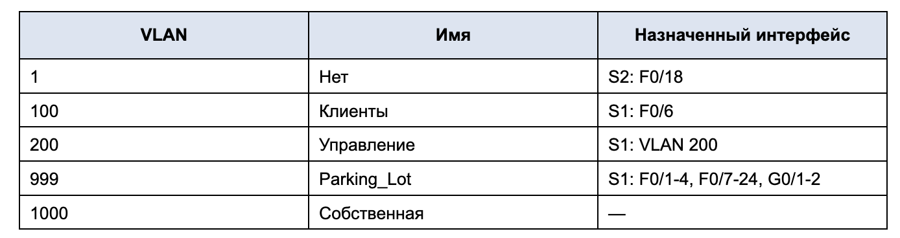

### Часть 1. Создание сети и настройка основных параметров устройства

#### Шаг 1. Создание схемы адресации

| Дано  |  |  | 
| ------------- | -------------------- | -------------------- |
| IP-адрес узла: | 192.168.1.0 |  | 
| Исходная маска подсети:  |  | 255.255.255.0  |  | 
| Новая маска подсети A  | поддерживающая 58 хостов | 255.255.255.192  | 
| Новая маска подсети B  | поддерживающая 28 хостов | 255.255.255.224  |  | 
| Новая маска подсети C  | оддерживающая 12 узлов | 255.255.255.240  |  | 

| Дано  |  |
| ------------- | -------------------- |
IP-адрес узла: | 11000000.10101000.00000001.0
Исходная маска подсети: | 11111111.11111111.11111111.00000000 -> /24
Сетевой адрес подсети с исходной маской: | 11000000.10101000.00000001.00000000 -> 192.168.1.0

|  | A | B | C |
| ------------- | -------------------- | -------------------- | -------------------- |
| Новая маска подсети | 11111111.11111111.11111111.11000000 -> /26 | 11111111.11111111.11111111.11100000 -> /27 | 11111111.11111111.11111111.11110000 -> /28 |
| Сетевой адрес подсети с новой маской | 11000000.10101000.00000001.00000000 -> 192.168.1.0 | 11000000.10101000.00000001.00000000 -> 192.168.1.64 | 11000000.10101000.00000001.00000000 -> 192.168.1.96 |

|  | A | B | C |
| ------------- | -------------------- | -------------------- | -------------------- |
| Количество бит подсети: количество едениц в новой маске | 26 | 27 | 28 |
| Количество созданных подсетей: количество отличных битов в исходной и новой маске - N; длина маски новой подсети -(минус) длина маски исходной подсети , сейчас 2^N = M | 26 - 24 = 2 -> 4 | 27 - 24 = 3 -> 8 | 28 - 24 = 4 -> 16 |
| Количество бит узлов в подсети: количество нулей в новой маске | 6 | 5 | 4 |
| Количество узлов в подсети: 2^n(Количество бит узлов) - 2 | 2^6 - 2 = 62 | 2^5 - 2 = 30 | 2^4 - 2 = 14 |
| Сетевой адрес этой подсети: новую маску наложить на IP-адрес | 192.168.1.0 | 192.168.1.64 | 192.168.1.96 |
| IPv4-адрес первого узла в этой подсети | 192.168.1.1 | 192.168.1.65 | 192.168.1.97 |
| IPv4-адрес последнего узла в этой подсети | 192.168.1.62 | 192.168.1.94 | 192.168.1.110 |
| Широковещательный IPv4-адрес в этой подсети | 192.168.1.63 | 192.168.1.95 | 192.168.1.111 |

| Ответ  | A | B | C |
| ------------- | -------------------- | -------------------- | -------------------- |
| Количество бит подсети| 26 | 27 | 28 |
| Количество созданных подсетей  | 4  | 8 | 16 |
| Количество бит узлов в подсети  | 6 | 5 | 4 |
| Количество узлов в подсети  | 62 | 30 | 14 |
| Сетевой адрес этой подсети | 192.168.1.0 | 192.168.1.64 | 192.168.1.96 |
| IPv4-адрес первого узла в этой подсети  | 192.168.1.1 | 192.168.1.65 | 192.168.1.97 |
| IPv4-адрес последнего узла в этой подсети  | 192.168.1.62 | 192.168.1.94 | 192.168.1.110 |
| Широковещательный IPv4-адрес в этой подсети  | 192.168.1.63 | 192.168.1.95 | 192.168.1.111 |

#### Шаг 2. Создайте сеть согласно топологии

#### Шаг 3. Произведите базовую настройку маршрутизаторов

</pre>

 R1 

<pre>

Router>enable
Router#configure terminal
Enter configuration commands, one per line.  End with CNTL/Z.
Router(config)#hostname R1
R1(config)#no ip domain-lookup
R1(config)#enable secret class
R1(config)#line console 0
R1(config-line)#password cisco
R1(config-line)#login
R1(config-line)#logging synchronous
R1(config-line)#exit
R1(config)#line vty 0 4
R1(config-line)#password cisco
R1(config-line)#login
R1(config-line)#exit
R1(config)#service password-encryption
R1(config)#banner motd #
Enter TEXT message.  End with the character '#'.
---=== R1 P A S S W O R D ===---#

R1(config)#end
R1#
%SYS-5-CONFIG_I: Configured from console by console

R1#copy running-config startup-config
Destination filename [startup-config]? 
Building configuration...
[OK]
R1#clock set 22:00:00 24 MARCH 2024
R1#wr
Building configuration...
[OK]
R1#

</pre>

</pre>

</pre>

 R2 

<pre>

Router>enable
Router#configure terminal
Enter configuration commands, one per line.  End with CNTL/Z.
Router(config)#hostname R2
R2(config)#no ip domain-lookup
R2(config)#enable secret class
R2(config)#line console 0
R2(config-line)#password cisco
R2(config-line)#login
R2(config-line)#logging synchronous
R2(config-line)#exit
R2(config)#line vty 0 4
R2(config-line)#password cisco
R2(config-line)#login
R2(config-line)#exit
R2(config)#service password-encryption
R2(config)#banner motd #
Enter TEXT message.  End with the character '#'.
---=== R2 P A S S W O R D ===---#

R2(config)#end
R2#
%SYS-5-CONFIG_I: Configured from console by console

R2#copy running-config startup-config
Destination filename [startup-config]? 
Building configuration...
[OK]
R2#clock set 22:00:00 24 MARCH 2024
R2#wr
Building configuration...
[OK]
R2#

</pre>

</pre>

#### Шаг 4. Настройка маршрутизации между сетями VLAN на маршрутизаторе R1

</pre>

 R1 

<pre>

R1#configure terminal
Enter configuration commands, one per line.  End with CNTL/Z.
R1(config)#interface g0/0/1
R1(config-if)#no shutdown 

R1(config-if)#
%LINK-5-CHANGED: Interface GigabitEthernet0/0/1, changed state to up

%LINEPROTO-5-UPDOWN: Line protocol on Interface GigabitEthernet0/0/1, changed state to up

R1(config-if)#exit
R1(config)#interface g0/0/1.100
R1(config-subif)#
%LINK-5-CHANGED: Interface GigabitEthernet0/0/1.100, changed state to up

%LINEPROTO-5-UPDOWN: Line protocol on Interface GigabitEthernet0/0/1.100, changed state to up

R1(config-subif)#encapsulation dot1Q 100
R1(config-subif)#ip address 192.168.1.1 255.255.255.192
R1(config-subif)#description VLAN 100 - Clients
R1(config-subif)#exit
R1(config)#interface g0/0/1.200
R1(config-subif)#
%LINK-5-CHANGED: Interface GigabitEthernet0/0/1.200, changed state to up

%LINEPROTO-5-UPDOWN: Line protocol on Interface GigabitEthernet0/0/1.200, changed state to up

R1(config-subif)#encapsulation dot1Q 200
R1(config-subif)#ip address 192.168.1.65 255.255.255.224
R1(config-subif)#description VLAN 200 - Management
R1(config-subif)#exit
R1(config)#interface g0/0/1.1000
R1(config-subif)#
%LINK-5-CHANGED: Interface GigabitEthernet0/0/1.1000, changed state to up

%LINEPROTO-5-UPDOWN: Line protocol on Interface GigabitEthernet0/0/1.1000, changed state to up

R1(config-subif)#encapsulation dot1Q 1000 native
R1(config-subif)#description VLAN 1000 - Own
R1(config-subif)#exit
R1(config)#

</pre>

</pre>

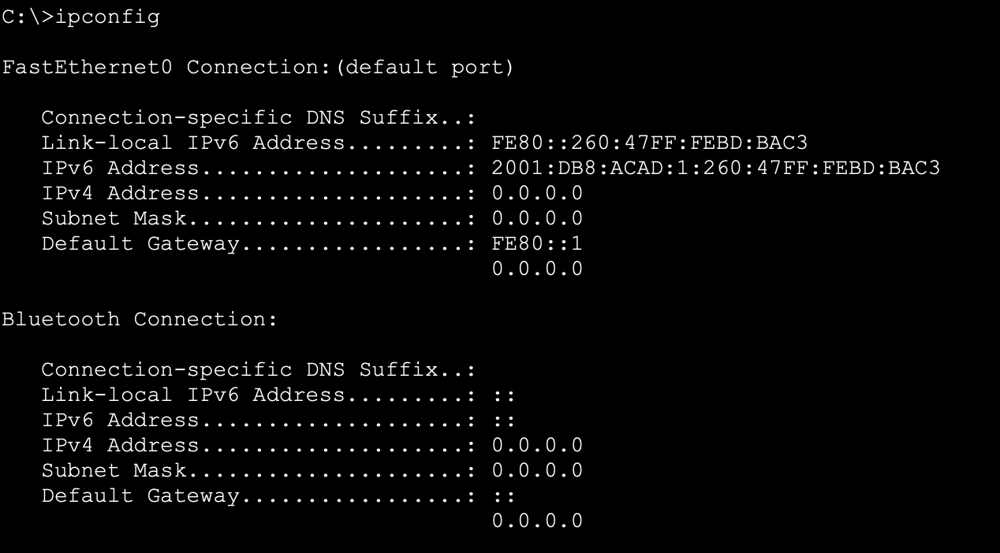

#### Шаг 5. Настройте G0/1 на R2, затем G0/0/0 и статическую маршрутизацию для обоих маршрутизаторов

</pre>

 R1 

<pre>

R1(config)#interface g0/0/0
R1(config-if)#ip ad
R1(config-if)#ip address 10.0.0.1 255.255.255.252
R1(config-if)#ip route 192.168.1.0 255.255.255.0 10.0.0.2
R1(config-if)#no shutdown 

R1(config-if)#
%LINK-5-CHANGED: Interface GigabitEthernet0/0/0, changed state to up

%LINEPROTO-5-UPDOWN: Line protocol on Interface GigabitEthernet0/0/0, changed state to up

R1(config-if)#

</pre>

</pre>

</pre>

 R2 

<pre>

R2(config)#interface g0/0/1
R2(config-if)#ip address 192.168.1.97 255.255.255.240
R2(config-if)#no shutdown 

R2(config-if)#
%LINK-5-CHANGED: Interface GigabitEthernet0/0/1, changed state to up

%LINEPROTO-5-UPDOWN: Line protocol on Interface GigabitEthernet0/0/1, changed state to up

R2(config-if)#exit
R2(config)#interface g0/0/0
R2(config-if)#ip address 10.0.0.2 255.255.255.252
R2(config-if)#no shutdown 

R2(config-if)#
%LINK-5-CHANGED: Interface GigabitEthernet0/0/0, changed state to up

R2(config-if)#exit
R2(config)#ip route 192.168.1.0 255.255.255.0 10.0.0.1
R2(config)#

</pre>

</pre>

| R1 | R2 |
| ------------- | -------------------- |
|  |  |

#### Шаг 6. Настройте базовые параметры каждого коммутатора

</pre>

 S1 

<pre>

Switch>
Switch>enable
Switch#configure terminal
Enter configuration commands, one per line.  End with CNTL/Z.
Switch(config)#hostname S1
S1(config)#no ip domain-lookup
S1(config)#enable secret class
S1(config)#line console 0
S1(config-line)#password cisco
S1(config-line)#login
S1(config-line)#logging synchronous
S1(config-line)#exit
S1(config)#line vty 0 4
S1(config-line)#password cisco
S1(config-line)#login
S1(config-line)#exit
S1(config)#service password-encryption
S1(config)#banner motd #
Enter TEXT message.  End with the character '#'.
---=== S1 P A S S W O R D ===---#

S1(config)#end
S1#
%SYS-5-CONFIG_I: Configured from console by console

S1#copy running-config startup-config
Destination filename [startup-config]? 
Building configuration...
[OK]
S1#clock set 22:00:00 24 MARCH 2024
S1#wr
Building configuration...
[OK]
S1#

</pre>

</pre>

</pre>

 S2 

<pre>

Switch>
Switch>enable
Switch#configure terminal
Enter configuration commands, one per line.  End with CNTL/Z.
Switch(config)#hostname S2
S2(config)#no ip domain-lookup
S2(config)#enable secret class
S2(config)#line console 0
S2(config-line)#password cisco
S2(config-line)#login
S2(config-line)#logging synchronous 
S2(config-line)#exit
S2(config)#line vty 0 4
S2(config-line)#password cisco
S2(config-line)#login
S2(config-line)#exit
S2(config)#service password-encryption 
S2(config)#banner motd #
Enter TEXT message.  End with the character '#'.
---=== S2 P A S S W O R D ===---#

S2(config)#end
S2#
%SYS-5-CONFIG_I: Configured from console by console

S2#copy running-config startup-config
Destination filename [startup-config]? 
Building configuration...
[OK]
S2#clock set 22:00:00 24 MARCH 2024
S2#wr
Building configuration...
[OK]
S2#

</pre>

</pre>

#### Шаг 7. Создайте сети VLAN на коммутаторе S1

</pre>

 S1 

<pre>

S1(config)#vlan 100
S1(config-vlan)#name Clients
S1(config-vlan)#exit
S1(config)#vlan 200
S1(config-vlan)#name Management
S1(config-vlan)#exit
S1(config)#vlan 999
S1(config-vlan)#name Parking_Lot
S1(config-vlan)#exit
S1(config)#vlan 1000
S1(config-vlan)#name Own
S1(config-vlan)#exit
S1(config)#inter
S1(config)#interface vlan 200
S1(config-if)#
%LINK-5-CHANGED: Interface Vlan200, changed state to up

S1(config-if)#ip ad
S1(config-if)#ip address 192.168.1.66 255.255.255.224
S1(config-if)#exit
S1(config)#ip de
S1(config)#ip default-gateway 10.0.0.1
S1(config)#
S1(config)#interface range f0/1-4, f0/7-24, g0/1-2
S1(config-if-range)#switchport access vlan 999
S1(config-if-range)#shutdown 

%LINK-5-CHANGED: Interface FastEthernet0/1, changed state to administratively down

%LINK-5-CHANGED: Interface FastEthernet0/2, changed state to administratively down

%LINK-5-CHANGED: Interface FastEthernet0/3, changed state to administratively down

%LINK-5-CHANGED: Interface FastEthernet0/4, changed state to administratively down

%LINK-5-CHANGED: Interface FastEthernet0/7, changed state to administratively down

%LINK-5-CHANGED: Interface FastEthernet0/8, changed state to administratively down

%LINK-5-CHANGED: Interface FastEthernet0/9, changed state to administratively down

%LINK-5-CHANGED: Interface FastEthernet0/10, changed state to administratively down

%LINK-5-CHANGED: Interface FastEthernet0/11, changed state to administratively down

%LINK-5-CHANGED: Interface FastEthernet0/12, changed state to administratively down

%LINK-5-CHANGED: Interface FastEthernet0/13, changed state to administratively down

%LINK-5-CHANGED: Interface FastEthernet0/14, changed state to administratively down

%LINK-5-CHANGED: Interface FastEthernet0/15, changed state to administratively down

%LINK-5-CHANGED: Interface FastEthernet0/16, changed state to administratively down

%LINK-5-CHANGED: Interface FastEthernet0/17, changed state to administratively down

%LINK-5-CHANGED: Interface FastEthernet0/18, changed state to administratively down

%LINK-5-CHANGED: Interface FastEthernet0/19, changed state to administratively down

%LINK-5-CHANGED: Interface FastEthernet0/20, changed state to administratively down

%LINK-5-CHANGED: Interface FastEthernet0/21, changed state to administratively down

%LINK-5-CHANGED: Interface FastEthernet0/22, changed state to administratively down

%LINK-5-CHANGED: Interface FastEthernet0/23, changed state to administratively down

%LINK-5-CHANGED: Interface FastEthernet0/24, changed state to administratively down

%LINK-5-CHANGED: Interface GigabitEthernet0/1, changed state to administratively down

%LINK-5-CHANGED: Interface GigabitEthernet0/2, changed state to administratively down
S1(config-if-range)#

</pre>

</pre>

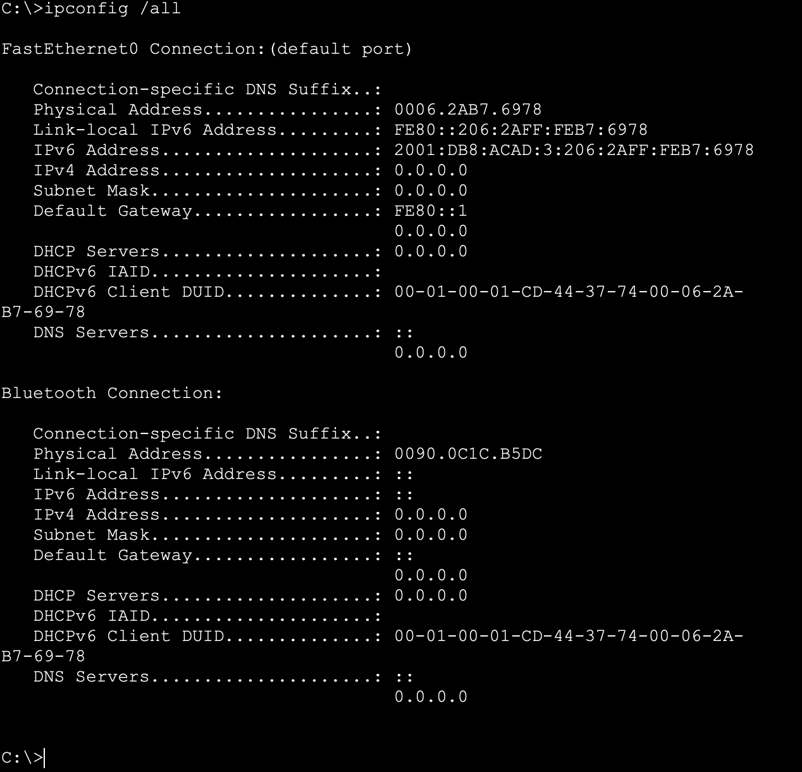

</pre>

 S2 

<pre>

S2(config)#interface vlan 1
S2(config-if)#no shutdown 

S2(config-if)#
%LINK-5-CHANGED: Interface Vlan1, changed state to up

%LINEPROTO-5-UPDOWN: Line protocol on Interface Vlan1, changed state to up

S2(config-if)#ip address 192.168.1.98 255.255.255.240
S2(config-if)#exit
S2(config)#ip default-gateway 10.0.0.2
S2(config)#
S2(config)#interface range f0/1-4, f0/6-17, f0/19-24, g0/1-2
S2(config-if-range)#shutdown 

</pre>

</pre>

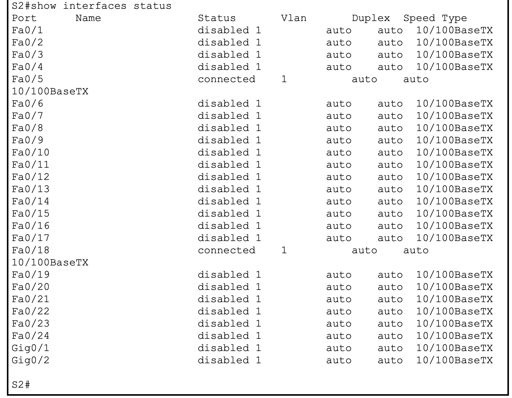

#### Шаг 8. Назначьте сети VLAN соответствующим интерфейсам коммутатора

</pre>

 S1 

<pre>

S1(config)#interface f0/6
S1(config-if)#switchport access vlan 100

</pre>

</pre>

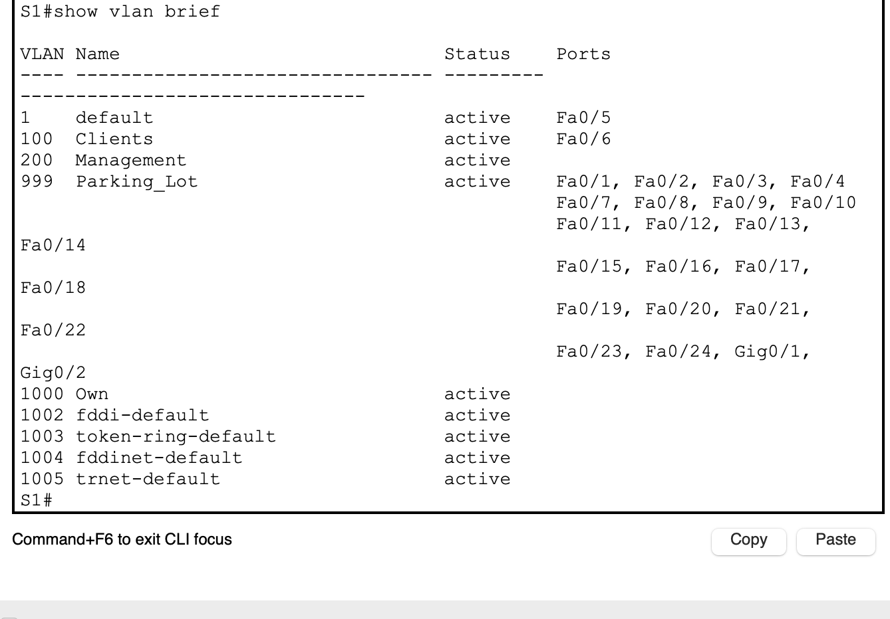
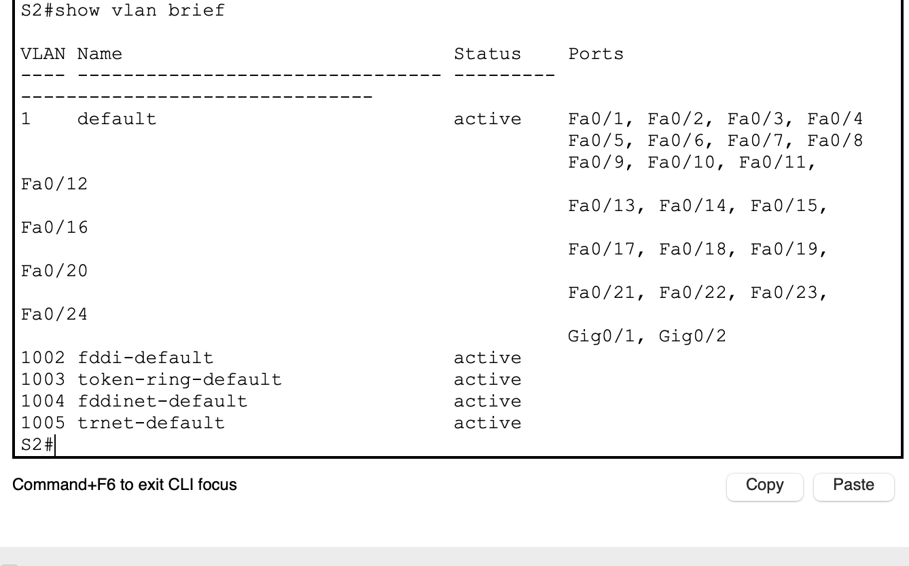

> Почему интерфейс F0/5 указан в VLAN 1?
>> При настройке назначения портов на VLAN данный порт не был указан в командах, и он остался в 1 Vlan

#### Шаг 9. Вручную настройте интерфейс S1 F0/5 в качестве транка 802.1Q

 S1 

<pre>

S1(config)#interface f0/5
S1(config-if)#switchport mode trunk 

S1(config-if)#
%LINEPROTO-5-UPDOWN: Line protocol on Interface FastEthernet0/5, changed state to down

%LINEPROTO-5-UPDOWN: Line protocol on Interface FastEthernet0/5, changed state to up

%LINEPROTO-5-UPDOWN: Line protocol on Interface Vlan200, changed state to up

S1(config-if)#switchport trunk native vlan 1000
S1(config-if)#switchport trunk allowed vlan 100,200,1000
S1(config-if)#end
S1#
%SYS-5-CONFIG_I: Configured from console by console

S1#wr
Building configuration...
[OK]
S1#

</pre>

</pre>

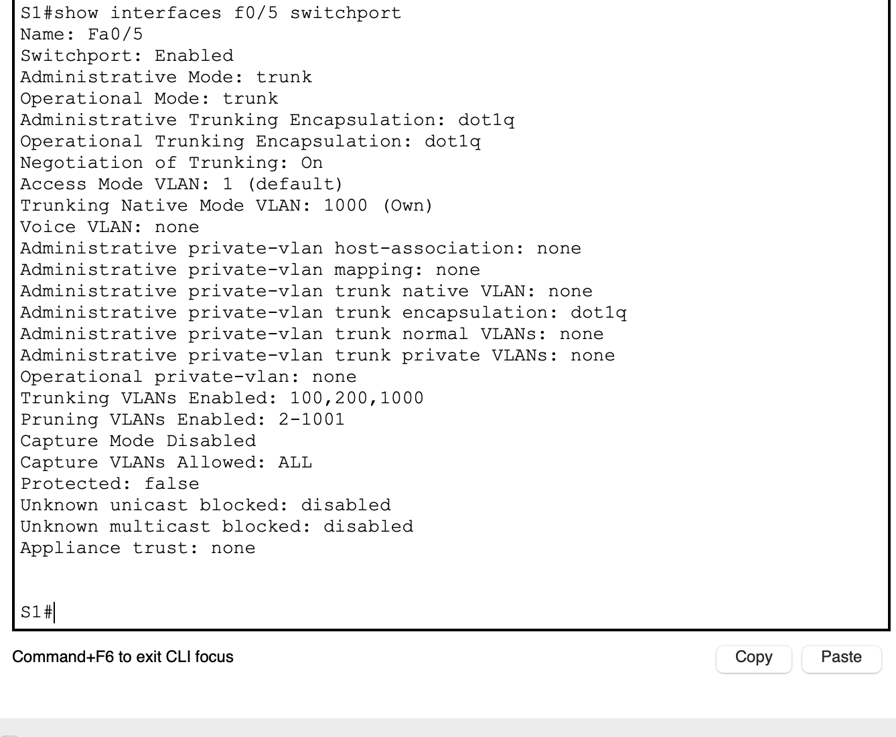

> Какой IP-адрес был бы у ПК, если бы он был подключен к сети с помощью DHCP?
>> IP ПК зависел бы от пула адресов что настроен на сервере

### Часть 2. Настройка и проверка двух серверов DHCPv4 на R1

#### Шаг 1. Настройте R1 с пулами DHCPv4 для двух поддерживаемых подсетей. Ниже приведен только пул DHCP для подсети A

</pre>

 R1 

<pre>

R1(config)#ip dhcp excluded-address 192.168.1.1
R1(config)#ip dhcp excluded-address 192.168.1.65
R1(config)#ip dhcp excluded-address 192.168.1.66
R1(config)#ip dhcp excluded-address 192.168.1.97
R1(config)#ip dhcp excluded-address 192.168.1.98
R1(config)#ip dhcp pool R1-POOL-A
R1(dhcp-config)#network 192.168.1.0 255.255.255.192
R1(dhcp-config)#default-router 10.0.0.1
R1(dhcp-config)#dns-server 10.0.0.1
R1(dhcp-config)#domain-name CCNA-lab.com
R1(dhcp-config)#lease 2 12 30 infinite
                ^
% Invalid input detected at '^' marker.

R1(config)#ip dhcp pool R1-POOL-C
R1(dhcp-config)#network 192.168.1.96 255.255.255.240
R1(dhcp-config)#default-router 10.0.0.1
R1(dhcp-config)#dns-server 10.0.0.1
R1(dhcp-config)#domain-name CCNA-lab.com
R1(dhcp-config)#lease 2 12 30 infinite
                ^
% Invalid input detected at '^' marker.
	
R1(dhcp-config)#exit
R1(config)#ip dhcp pool R2_Client_LAN
R1(dhcp-config)#network 192.168.1.96 255.255.255.240
R1(dhcp-config)#default-router 10.0.0.1
R1(dhcp-config)#dns-server 10.0.0.1
R1(dhcp-config)#domain-name CCNA-lab.com
R1(dhcp-config)#

</pre>

</pre>

### Команды lease 2 12 30 infinite нет в Packet Tracer

#### Шаг 2. Сохраните конфигурацию

</pre>

 R1 

<pre>

R1#copy running-config startup-config 
Destination filename [startup-config]? 
Building configuration...
[OK]
R1#wr
Building configuration...
[OK]
R1#

</pre>

</pre>

#### Шаг 3. Проверка конфигурации сервера DHCPv4

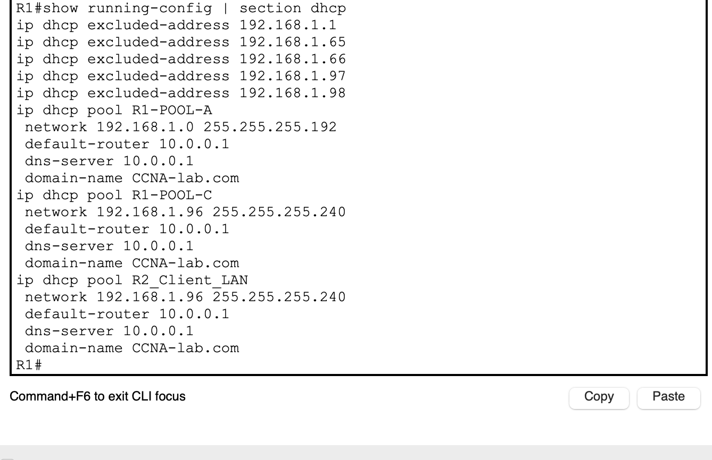
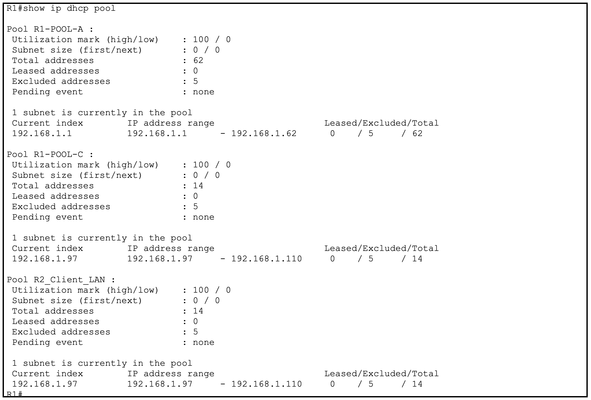
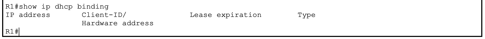
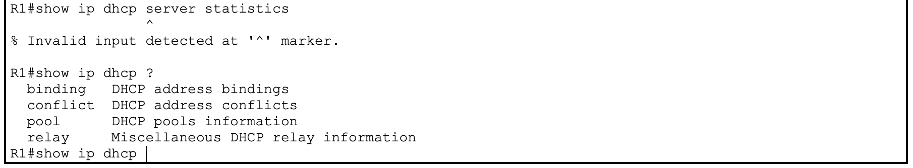

### Команды "ip dhcp server statistics" нет в Packet Tracer

#### Шаг 4. Попытка получить IP-адрес от DHCP на PC-A

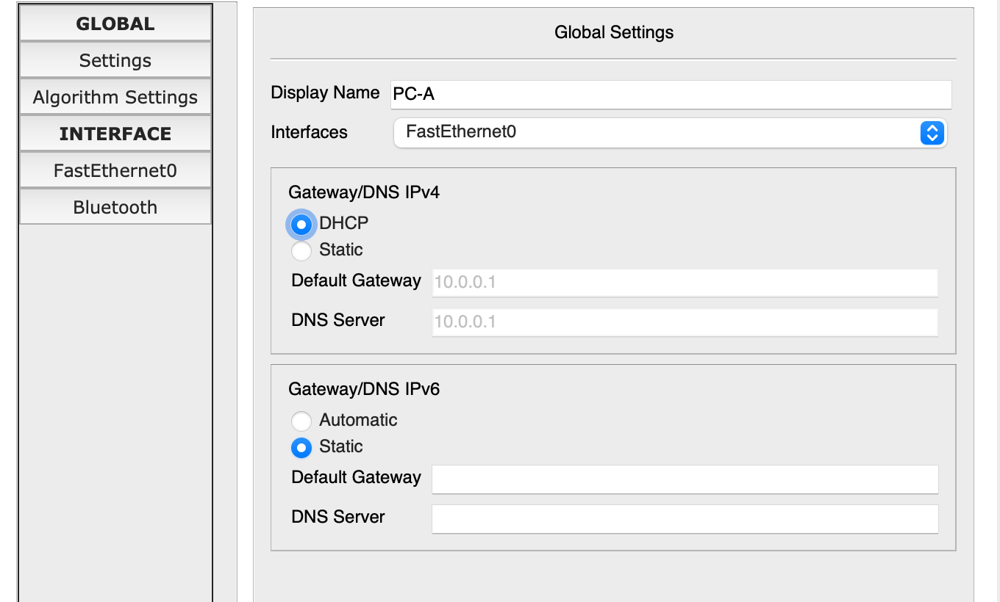
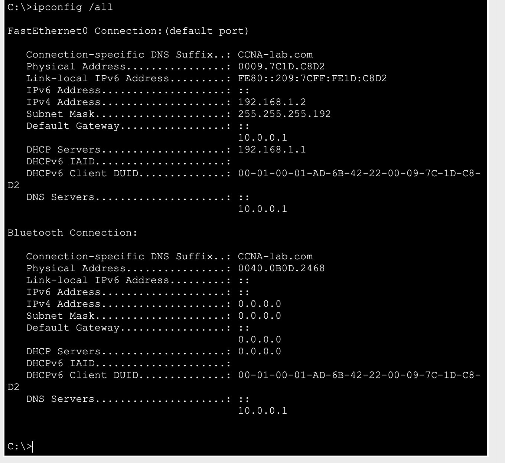
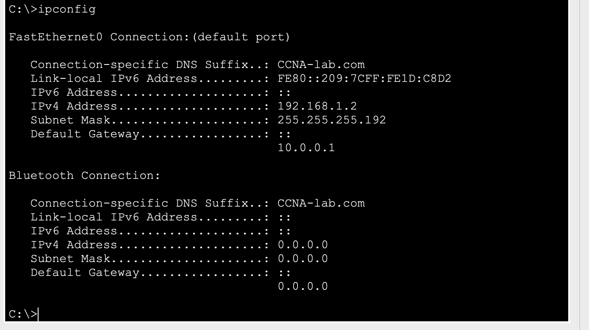
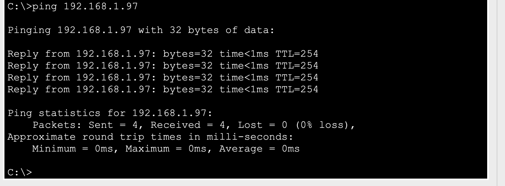

### Часть 3. Настройка и проверка DHCP-ретрансляции на R2

#### Шаг 1. Настройка R2 в качестве агента DHCP-ретрансляции для локальной сети на G0/0/1

</pre>

 R1 

<pre>

R2(config)#interface g0/0/1
R2(config-if)#ip helper-address 10.0.0.1
R2(config-if)#end
R2#
%SYS-5-CONFIG_I: Configured from console by console

R2#wr
Building configuration...
[OK]
R2#

</pre>

</pre>

#### Шаг 2. Попытка получить IP-адрес от DHCP на PC-B

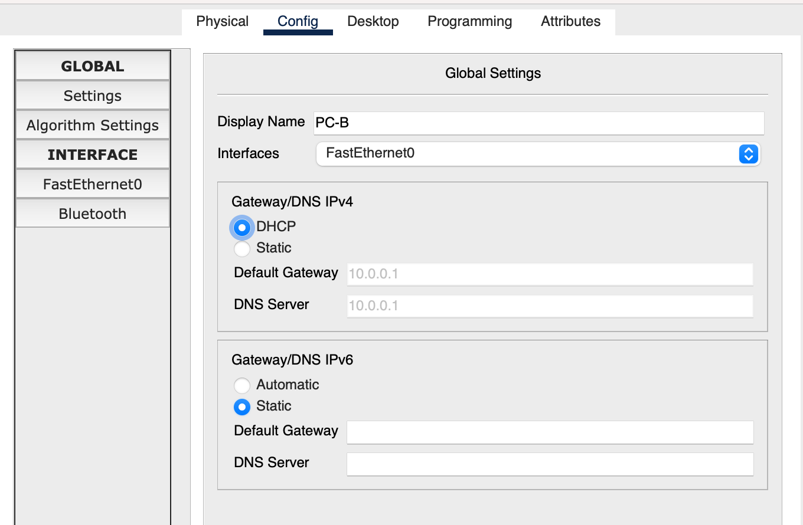
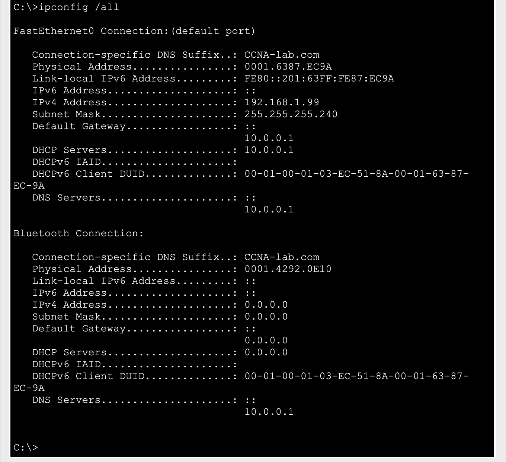
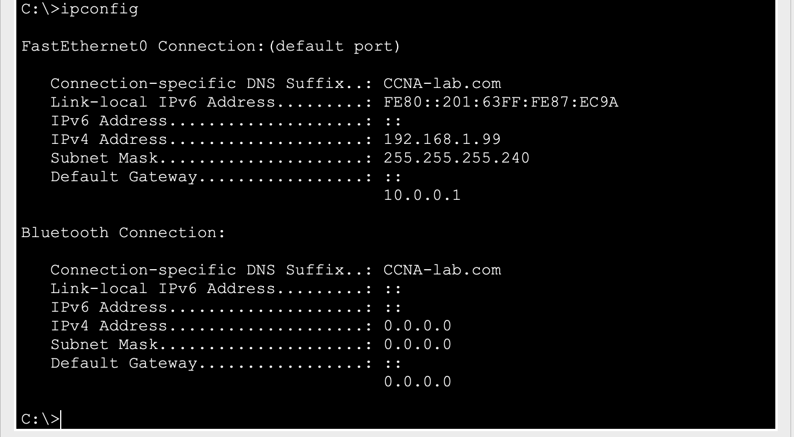
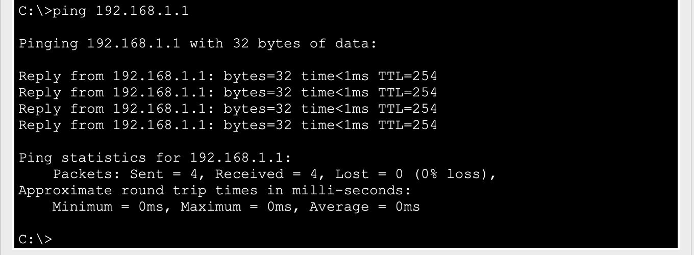
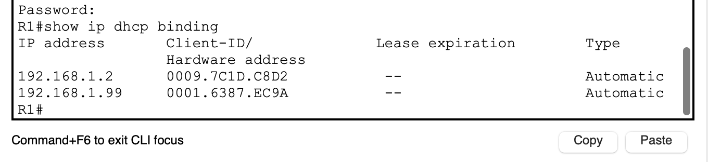
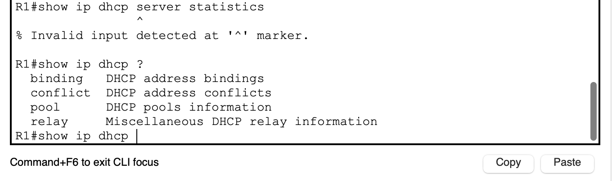