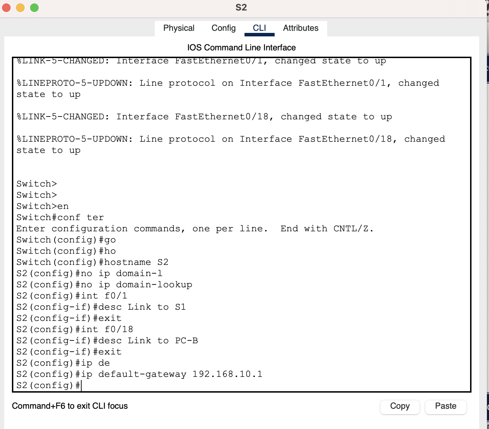

# Лабораторная работа - Конфигурация безопасности коммутатора

## Топология

## Таблица адресации

### Часть 1. Создание сети и настройка основных параметров устройства

#### Шаг 1. Создайте сеть

#### Шаг 2. Настройте маршрутизатор R1

#### Шаг 3. Настройка и проверка основных параметров коммутатора

### Часть 2. Создание сети и настройка основных параметров устройства

#### Шаг 1. Сконфигруриуйте VLAN 10

#### Шаг 2. Сконфигруриуйте SVI для VLAN 10

#### Шаг 3. Настройте VLAN 333 с именем Native на S1 и S2

#### Шаг 3. Настройте VLAN 999 с именем ParkingLot на S1 и S2

### Часть 3. Настройки безопасности коммутатора

#### Шаг 1. Релизация магистральных соединений 802.1Q

#### Шаг 2. Настройка портов доступа

#### Шаг 3. Безопасность неиспользуемых портов коммутатора

#### Шаг 4. Документирование и реализация функций безопасности порта

| Функция	| Настройка по умолчанию |
| :---------: |:-----------:| 
| Защита портов	 | Disabled |
| Максимальное количество записей MAC-адресов	 | 1 |
| Режим проверки на нарушение безопасности | Disabled |
| Aging Time | 0 mins |
| Aging Type | Absolute |
| Secure Static Address Aging | Disabled |
| Sticky MAC Address | 0 |

### Команды switch port-security aging type нет

#### Шаг 5. Реализовать безопасность DHCP snooping

#### Шаг 6. Реализовать безопасность DHCP snooping

#### Шаг 7. Проверьте наличие сквозного подключения

| от    | куда | Результат |
| :----:| :---------:| :---------:|
| PC-A | R1 192.168.10.1   | Успех |
| PC-A | Loopback0 10.10.1.1 | Успех |
| PC-A | S1 192.168.10.201 | Успех |
| PC-A | S2 192.168.10.202 | Успех |
| PC-A | PC-B 192.168.10.10   | Успех |

 Ping from PC-A 

<pre>

C:\>ping 192.168.10.1

Pinging 192.168.10.1 with 32 bytes of data:

Reply from 192.168.10.1: bytes=32 time<1ms TTL=255
Reply from 192.168.10.1: bytes=32 time=1ms TTL=255
Reply from 192.168.10.1: bytes=32 time<1ms TTL=255
Reply from 192.168.10.1: bytes=32 time<1ms TTL=255

Ping statistics for 192.168.10.1:
    Packets: Sent = 4, Received = 4, Lost = 0 (0% loss),
Approximate round trip times in milli-seconds:
    Minimum = 0ms, Maximum = 1ms, Average = 0ms

C:\>ping 10.10.1.1

Pinging 10.10.1.1 with 32 bytes of data:

Reply from 10.10.1.1: bytes=32 time=31ms TTL=255
Reply from 10.10.1.1: bytes=32 time<1ms TTL=255
Reply from 10.10.1.1: bytes=32 time=14ms TTL=255
Reply from 10.10.1.1: bytes=32 time<1ms TTL=255

Ping statistics for 10.10.1.1:
    Packets: Sent = 4, Received = 4, Lost = 0 (0% loss),
Approximate round trip times in milli-seconds:
    Minimum = 0ms, Maximum = 31ms, Average = 11ms

C:\>ping 192.168.10.201

Pinging 192.168.10.201 with 32 bytes of data:

Request timed out.
Reply from 192.168.10.201: bytes=32 time<1ms TTL=255
Reply from 192.168.10.201: bytes=32 time<1ms TTL=255
Reply from 192.168.10.201: bytes=32 time<1ms TTL=255

Ping statistics for 192.168.10.201:
    Packets: Sent = 4, Received = 3, Lost = 1 (25% loss),
Approximate round trip times in milli-seconds:
    Minimum = 0ms, Maximum = 0ms, Average = 0ms

C:\>ping 192.168.10.202

Pinging 192.168.10.202 with 32 bytes of data:

Request timed out.
Reply from 192.168.10.202: bytes=32 time<1ms TTL=255
Reply from 192.168.10.202: bytes=32 time<1ms TTL=255
Reply from 192.168.10.202: bytes=32 time=2ms TTL=255

Ping statistics for 192.168.10.202:
    Packets: Sent = 4, Received = 3, Lost = 1 (25% loss),
Approximate round trip times in milli-seconds:
    Minimum = 0ms, Maximum = 2ms, Average = 0ms

C:\>
C:\>
C:\>
C:\>ping 192.168.10.10

Pinging 192.168.10.10 with 32 bytes of data:

Reply from 192.168.10.10: bytes=32 time<1ms TTL=128
Reply from 192.168.10.10: bytes=32 time<1ms TTL=128
Reply from 192.168.10.10: bytes=32 time<1ms TTL=128
Reply from 192.168.10.10: bytes=32 time<1ms TTL=128

Ping statistics for 192.168.10.10:
    Packets: Sent = 4, Received = 4, Lost = 0 (0% loss),
Approximate round trip times in milli-seconds:
    Minimum = 0ms, Maximum = 0ms, Average = 0ms

C:\>

</pre>

| от    | куда | Результат |
| :----:| :---------:| :---------:|
| PC-B | R1 192.168.10.1   | Успех |
| PC-B | Loopback 0 10.10.1.1 | Успех |
| PC-B | S1 192.168.10.201 | Успех |
| PC-B | S2 192.168.10.202 | Успех |
| PC-B | PC-A 192.168.10.11   | Успех |

 Ping from PC-B 

<pre>

C:\>ping 192.168.10.1

Pinging 192.168.10.1 with 32 bytes of data:

Reply from 192.168.10.1: bytes=32 time<1ms TTL=255
Reply from 192.168.10.1: bytes=32 time<1ms TTL=255
Reply from 192.168.10.1: bytes=32 time<1ms TTL=255
Reply from 192.168.10.1: bytes=32 time=1ms TTL=255

Ping statistics for 192.168.10.1:
    Packets: Sent = 4, Received = 4, Lost = 0 (0% loss),
Approximate round trip times in milli-seconds:
    Minimum = 0ms, Maximum = 1ms, Average = 0ms

C:\>ping 10.10.1.1

Pinging 10.10.1.1 with 32 bytes of data:

Reply from 10.10.1.1: bytes=32 time=15ms TTL=255
Reply from 10.10.1.1: bytes=32 time<1ms TTL=255
Reply from 10.10.1.1: bytes=32 time<1ms TTL=255
Reply from 10.10.1.1: bytes=32 time<1ms TTL=255

Ping statistics for 10.10.1.1:
    Packets: Sent = 4, Received = 4, Lost = 0 (0% loss),
Approximate round trip times in milli-seconds:
    Minimum = 0ms, Maximum = 15ms, Average = 3ms

C:\>ping 192.168.10.201

Pinging 192.168.10.201 with 32 bytes of data:

Request timed out.
Reply from 192.168.10.201: bytes=32 time<1ms TTL=255
Reply from 192.168.10.201: bytes=32 time<1ms TTL=255
Reply from 192.168.10.201: bytes=32 time=1ms TTL=255

Ping statistics for 192.168.10.201:
    Packets: Sent = 4, Received = 3, Lost = 1 (25% loss),
Approximate round trip times in milli-seconds:
    Minimum = 0ms, Maximum = 1ms, Average = 0ms

C:\>ping 192.168.10.202

Pinging 192.168.10.202 with 32 bytes of data:

Request timed out.
Reply from 192.168.10.202: bytes=32 time<1ms TTL=255
Reply from 192.168.10.202: bytes=32 time<1ms TTL=255
Reply from 192.168.10.202: bytes=32 time<1ms TTL=255

Ping statistics for 192.168.10.202:
    Packets: Sent = 4, Received = 3, Lost = 1 (25% loss),
Approximate round trip times in milli-seconds:
    Minimum = 0ms, Maximum = 0ms, Average = 0ms

C:\>ping 192.168.10.11

Pinging 192.168.10.11 with 32 bytes of data:

Reply from 192.168.10.11: bytes=32 time<1ms TTL=128
Reply from 192.168.10.11: bytes=32 time<1ms TTL=128
Reply from 192.168.10.11: bytes=32 time<1ms TTL=128
Reply from 192.168.10.11: bytes=32 time<1ms TTL=128

Ping statistics for 192.168.10.11:
    Packets: Sent = 4, Received = 4, Lost = 0 (0% loss),
Approximate round trip times in milli-seconds:
    Minimum = 0ms, Maximum = 0ms, Average = 0ms

C:\>

</pre>

| от    | куда | Результат |
| :----:| :---------:| :---------:|
| S1 | R1 192.168.10.1   | Успех |
| S1 | Loopback0 10.10.1.1 | Успех |
| S1 | S2 192.168.10.202 | Успех |
| S1 | PC-A 192.168.10.11   | Успех |
| S1 | PC-B 192.168.10.10   | Успех |

 Ping from S1 

<pre>

S1#ping 192.168.10.1

Type escape sequence to abort.
Sending 5, 100-byte ICMP Echos to 192.168.10.1, timeout is 2 seconds:
.!!!!
Success rate is 80 percent (4/5), round-trip min/avg/max = 0/0/0 ms

S1#ping 10.10.1.1

Type escape sequence to abort.
Sending 5, 100-byte ICMP Echos to 10.10.1.1, timeout is 2 seconds:
!!!!!
Success rate is 100 percent (5/5), round-trip min/avg/max = 0/0/0 ms

S1#ping 192.168.10.202

Type escape sequence to abort.
Sending 5, 100-byte ICMP Echos to 192.168.10.202, timeout is 2 seconds:
..!!!
Success rate is 60 percent (3/5), round-trip min/avg/max = 0/0/0 ms

S1#ping 192.168.10.11

Type escape sequence to abort.
Sending 5, 100-byte ICMP Echos to 192.168.10.11, timeout is 2 seconds:
!!!!!
Success rate is 100 percent (5/5), round-trip min/avg/max = 0/0/0 ms

S1#ping 192.168.10.10

Type escape sequence to abort.
Sending 5, 100-byte ICMP Echos to 192.168.10.10, timeout is 2 seconds:
!!!!!
Success rate is 100 percent (5/5), round-trip min/avg/max = 0/6/30 ms

S1#

</pre>

| от    | куда | Результат |
| :----:| :---------:| :---------:|
| S2 | R1 192.168.10.1   | Успех |
| S2 | Loopback0 10.10.1.1 | Успех |
| S2 | S1 192.168.10.201 | Успех |
| S2 | PC-A 192.168.10.11   | Успех |
| S2 | PC-B 192.168.10.10   | Успех |

 Ping from S2 

<pre>

S2>ping 192.168.10.1

Type escape sequence to abort.
Sending 5, 100-byte ICMP Echos to 192.168.10.1, timeout is 2 seconds:
.!!!!
Success rate is 80 percent (4/5), round-trip min/avg/max = 0/1/6 ms

S2>ping 10.10.1.1

Type escape sequence to abort.
Sending 5, 100-byte ICMP Echos to 10.10.1.1, timeout is 2 seconds:
!!!!!
Success rate is 100 percent (5/5), round-trip min/avg/max = 0/0/0 ms

S2>ping 192.168.10.201

Type escape sequence to abort.
Sending 5, 100-byte ICMP Echos to 192.168.10.201, timeout is 2 seconds:
!!!!!
Success rate is 100 percent (5/5), round-trip min/avg/max = 0/0/0 ms

S2>ping 192.168.10.11

Type escape sequence to abort.
Sending 5, 100-byte ICMP Echos to 192.168.10.11, timeout is 2 seconds:
!!!!!
Success rate is 100 percent (5/5), round-trip min/avg/max = 0/2/12 ms

S2>ping 192.168.10.10

Type escape sequence to abort.
Sending 5, 100-byte ICMP Echos to 192.168.10.10, timeout is 2 seconds:
!!!!!
Success rate is 100 percent (5/5), round-trip min/avg/max = 0/0/1 ms

S2>

</pre>

| от    | куда | Результат |
| :----:| :---------:| :---------:|
| R1 | S1 192.168.10.201 | Успех |
| R1 | S2 192.168.10.202 | Успех |
| R1 | PC-A 192.168.10.11   | Успех |
| R1 | PC-B 192.168.10.10   | Успех |

 Ping from R1 

<pre>

S2>ping 192.168.10.1

Type escape sequence to abort.
Sending 5, 100-byte ICMP Echos to 192.168.10.1, timeout is 2 seconds:
.!!!!
Success rate is 80 percent (4/5), round-trip min/avg/max = 0/1/6 ms

S2>ping 10.10.1.1

Type escape sequence to abort.
Sending 5, 100-byte ICMP Echos to 10.10.1.1, timeout is 2 seconds:
!!!!!
Success rate is 100 percent (5/5), round-trip min/avg/max = 0/0/0 ms

S2>ping 192.168.10.201

Type escape sequence to abort.
Sending 5, 100-byte ICMP Echos to 192.168.10.201, timeout is 2 seconds:
!!!!!
Success rate is 100 percent (5/5), round-trip min/avg/max = 0/0/0 ms

S2>ping 192.168.10.11

Type escape sequence to abort.
Sending 5, 100-byte ICMP Echos to 192.168.10.11, timeout is 2 seconds:
!!!!!
Success rate is 100 percent (5/5), round-trip min/avg/max = 0/2/12 ms

S2>ping 192.168.10.10

Type escape sequence to abort.
Sending 5, 100-byte ICMP Echos to 192.168.10.10, timeout is 2 seconds:
!!!!!
Success rate is 100 percent (5/5), round-trip min/avg/max = 0/0/1 ms

S2>

</pre>

> С точки зрения безопасности порта на S2, почему нет значения таймера для оставшегося возраста в минутах, когда было сконфигурировано динамическое обучение - sticky?
>> При динамическом обучении sticky mac addres подключенного устройства записывается в постоянную память (NVRAM)

> Что касается безопасности порта на S2, если вы загружаете скрипт текущей конфигурации на S2, почему порту 18 на PC-B никогда не получит IP-адрес через DHCP?
>> На порту f0/5 включен ограничение по DHCP пакетам

> Что касается безопасности порта, в чем разница между типом абсолютного устаревания и типом устаревание по неактивности?
>> При абсолютном устаревании адреса порт удаляется по истечении указаного времени в настройках, 
т.е. есть ограничение по времени работы подключеного устройства к порту. 
При неактивности только в случае если отключеное состояние порта превысело время указаное при
настройке, т.е. нет ограничение работы подключеного устройства к порту по времени 