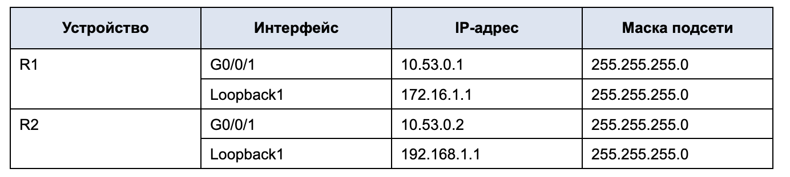

# Лабораторная работа. Настройка протокола OSPFv2 для одной области

## Топология

## Таблица адресации

### Часть 1. Создание сети и настройка основных параметров устройства

#### Шаг 1. Создайте сеть согласно топологии

#### Шаг 2. Произведите базовую настройку маршрутизаторов

</pre>

 R1 

<pre>

Router>enable
Router#configure terminal
Enter configuration commands, one per line.  End with CNTL/Z.
Router(config)#hostname R1
R1(config)#no ip domain-lookup
R1(config)#enable secret class
R1(config)#line console 0
R1(config-line)#password cisco
R1(config-line)#login
R1(config-line)#logging synchronous
R1(config-line)#exit
R1(config)#line vty 0 4
R1(config-line)#password cisco
R1(config-line)#login
R1(config-line)#exit
R1(config)#service password-encryption
R1(config)#banner motd #
Enter TEXT message.  End with the character '#'.
---=== R1 P A S S W O R D ===---#

R1(config)#end
R1#
%SYS-5-CONFIG_I: Configured from console by console

R1#copy running-config startup-config
Destination filename [startup-config]? 
Building configuration...
[OK]
R1#

</pre>

</pre>

</pre>

 R2 

<pre>

Router>enable
Router#configure terminal
Enter configuration commands, one per line.  End with CNTL/Z.
Router(config)#hostname R2
R2(config)#no ip domain-lookup
R2(config)#enable secret class
R2(config)#line console 0
R2(config-line)#password cisco
R2(config-line)#login
R2(config-line)#logging synchronous
R2(config-line)#exit
R2(config)#line vty 0 4
R2(config-line)#password cisco
R2(config-line)#login
R2(config-line)#exit
R2(config)#service password-encryption
R2(config)#banner motd #
Enter TEXT message.  End with the character '#'.
---=== R2 P A S S W O R D ===---#

R2(config)#end
R2#
%SYS-5-CONFIG_I: Configured from console by console

R2#copy running-config startup-config
Destination filename [startup-config]? 
Building configuration...
[OK]
R2#

</pre>

</pre>

#### Шаг 3. Настройте базовые параметры каждого коммутатора

</pre>

 S1 

<pre>

Switch>
Switch>enable
Switch#configure terminal
Enter configuration commands, one per line.  End with CNTL/Z.
Switch(config)#hostname S1
S1(config)#no ip domain-lookup
S1(config)#enable secret class
S1(config)#line console 0
S1(config-line)#password cisco
S1(config-line)#login
S1(config-line)#logging synchronous
S1(config-line)#exit
S1(config)#line vty 0 4
S1(config-line)#password cisco
S1(config-line)#login
S1(config-line)#exit
S1(config)#service password-encryption
S1(config)#banner motd #
Enter TEXT message.  End with the character '#'.
---=== S1 P A S S W O R D ===---#

S1(config)#end
S1#
%SYS-5-CONFIG_I: Configured from console by console

S1#copy running-config startup-config
Destination filename [startup-config]? 
Building configuration...
[OK]
S1#

</pre>

</pre>

</pre>

 S2 

<pre>

Switch>
Switch>enable
Switch#configure terminal
Enter configuration commands, one per line.  End with CNTL/Z.
Switch(config)#hostname S2
S2(config)#no ip domain-lookup
S2(config)#enable secret class
S2(config)#line console 0
S2(config-line)#password cisco
S2(config-line)#login
S2(config-line)#logging synchronous 
S2(config-line)#exit
S2(config)#line vty 0 4
S2(config-line)#password cisco
S2(config-line)#login
S2(config-line)#exit
S2(config)#service password-encryption 
S2(config)#banner motd #
Enter TEXT message.  End with the character '#'.
---=== S2 P A S S W O R D ===---#

S2(config)#end
S2#
%SYS-5-CONFIG_I: Configured from console by console

S2#copy running-config startup-config
Destination filename [startup-config]? 
Building configuration...
[OK]
S2#

</pre>

</pre>

### Часть 2. Настройка и проверка базовой работы протокола OSPFv2 для одной области

#### Шаг 1. Настройте адреса интерфейса и базового OSPFv2 на каждом маршрутизаторе

</pre>

 R1 

<pre>

R1>en
Password: 
R1#conf ter
Enter configuration commands, one per line.  End with CNTL/Z.
R1(config)#inter
R1(config)#interface g0/0/1
R1(config-if)#ip ad
R1(config-if)#ip address 10.53.0.1 255.255.255.0
R1(config-if)#no sh
R1(config-if)#no shutdown 

R1(config-if)#
%LINK-5-CHANGED: Interface GigabitEthernet0/0/1, changed state to up

%LINEPROTO-5-UPDOWN: Line protocol on Interface GigabitEthernet0/0/1, changed state to up

R1(config-if)#exit
R1(config)#int
R1(config)#interface lo
R1(config)#interface loopback 1

R1(config-if)#
%LINK-5-CHANGED: Interface Loopback1, changed state to up

%LINEPROTO-5-UPDOWN: Line protocol on Interface Loopback1, changed state to up

R1(config-if)#ip ad
R1(config-if)#ip address 172.16.1.1 255.255.255.0
R1(config-if)#no sh
R1(config-if)#no shutdown 
R1(config-if)#end
R1#
%SYS-5-CONFIG_I: Configured from console by console

R1#wr
Building configuration...
[OK]
R1#

</pre>

</pre>

</pre>

 R2 

<pre>

R2>en
Password: 
R2#
R2#
R2#conf ter
Enter configuration commands, one per line.  End with CNTL/Z.
R2(config)#int g0/0/1
R2(config-if)#ip ad
R2(config-if)#ip address 10.53.0.2 255.255.255.0
R2(config-if)#no sh
R2(config-if)#no shutdown 

R2(config-if)#
%LINK-5-CHANGED: Interface GigabitEthernet0/0/1, changed state to up

%LINEPROTO-5-UPDOWN: Line protocol on Interface GigabitEthernet0/0/1, changed state to up

R2(config-if)#exit
R2(config)#int
R2(config)#interface lo
R2(config)#interface loopback 1

R2(config-if)#
%LINK-5-CHANGED: Interface Loopback1, changed state to up

%LINEPROTO-5-UPDOWN: Line protocol on Interface Loopback1, changed state to up

R2(config-if)#ip ad
R2(config-if)#ip address 192.168.1.1 255.255.255.0
R2(config-if)#end
R2#
%SYS-5-CONFIG_I: Configured from console by console

R2#wr
Building configuration...
[OK]
R2#

</pre>

</pre>

</pre>

 R1 

<pre>

R1(config)#router ospf 56
R1(config-router)#router-id 1.1.1.1	
R1(config-router)#network 172.16.1.1 0.0.0.255 area 0
R1(config-router)#network 10.53.0.1 0.0.0.255 area 0
R1(config-router)#
R1(config-router)#
R1(config-router)#
R1(config-router)#end

</pre>

</pre>

</pre>

 R2 

<pre>

R2(config)#router ospf 56
R2(config-router)#router-id 2.2.2.2
R2(config-router)#exit
R2(config)#interface loopback 1
R2(config-if)#ip ospf 56 area 0
R2(config-if)#exit
R2(config)#router ospf 56
R2(config-router)#passive-interface loopback 1
R2(config-router)#exit	
R2(config)#router ospf 56
R2(config-router)#network 192.168.1.1 0.0.0.255 area 0
R2(config-router)#router-id 2.2.2.2
R2(config-router)#network 10.53.0.2 0.0.0.255 area 0
R2(config-router)#end

</pre>

</pre>

> Какой маршрутизатор является DR?
>> R2

> Какой маршрутизатор является BDR?
>> R1

> Каковы критерии отбора?
>> DR выбирается маршрутизатор с самым высоким приоритетом интерфейса OSPF или с наибольшим Router ID. BDR выбирается второй маршрутизатор по приоритету или со вторым самым высоким Router ID.

### Часть 3. Оптимизация и проверка конфигурации OSPFv2 для одной области

#### Шаг 1. Реализация различных оптимизаций на каждом маршрутизаторе

#### Шаг 2. Убедитесь, что оптимизация OSPFv2 реализовалась

> Почему стоимость OSPF для маршрута по умолчанию отличается от стоимости OSPF в R1 для сети 192.168.1.0/24?
>> Основной метрикой, используемой в OSPF для выбора лучшего маршрута, является стоимость: в таблицу маршрутизации будет добавлен маршрут с меньшим значением стоимости. Значение стоимости указывается в качестве параметра каждого интерфейса, ассоциированного с OSPF и может принимать значения от 1 до 65535. Парметр "O" что маршрут построен OSPF и его стоймость рассчитана в зависимости от параметра интерфейса. O+E2 внешние маршруты 2-го типа (External), то есть они были введены в процесс OSPF извне и его стоймость равна 1, по умолчанию, но можем сами назначит ей необходимую стоймость. Для маршрута 2 типа стоимость при передаче по сети не увеличивается.